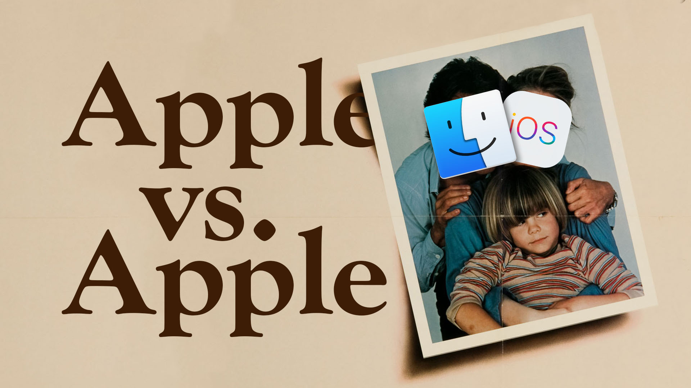

In the last couple years, I've heard iPad users frequently bemoan the professional community not "taking them seriously".  This reached a fever pitch with the release of the new (and pretty great looking) [iPad Pros](https://www.apple.com/ipad-pro/) and the onslaught of reviews deeming the new device amazing but "still an iPad".

As someone deep in the Mac ecosystem but definitely interested in iOS, I've always regarded these complaints as people being overly sensitive.  When people say they can't do "real work" on an iPad, I've always translated that to mean they can't do "their work" on an iPad.  I assumed nobody outside of internet trolls were actually saying that people who use iPads aren't "real" professionals..

Then I read [this tweet](https://twitter.com/tomwarren/status/1063216386573504512) from senior editor at [The Verge](https://www.theverge.com), Tom Warren

<blockquote class="twitter-tweet" data-lang="en">
Nilay made this point on Vergecast, but the people who have replaced their laptops with an iPad are people who do fuck all work. The rest of us hard working people use a laptop, because we have real stuff to do other than send emails and fart around. Don’t @ me ¯\_(ツ)_/¯
&mdash; Tom Warren (@tomwarren) <a href="https://twitter.com/tomwarren/status/1063216386573504512?ref_src=twsrc%5Etfw">November 15, 2018</a></blockquote>  

Granted, Tom's primary focus is Windows news, but I think this goes to show that this sentiment of the iPad as a toy is not relegated to comment section flame wars, but actual influential members of the prominent tech press.

It feels like we're entering a bizarre OS war reminiscent of the Windows vs Mac or Android vs iOS days, complete with passionate angry "fans" attacking the each other as being "stuck in the past" or "using toys to try to do real work".  Only this time both platforms, iOS and MacOS, are owned by the same company.

It's weird because I don't really see them as competing platforms as much as complementing platforms.  A Mac, an iPad, and an iPhone make an incredible combination.  It's more like an iMac vs a MacBook. People with desktop computers don't usually make fun of laptops being underpowered.  And laptop users don't usually make fun of desktop's lack of portability. And many people have both!

Admittedly none of this matters.  It's probably just typical Twitter / Tech Blog drama.  But on behalf of non-iPad users everywhere, I'm sorry for the jerks out there.  iOS is not ready to replace my Mac (I don't think[^1]), but that doesn't mean it's not ready for anybody.  Personally, I'm hoping [iOS 13](https://www.cultofmac.com/546401/ios-13-will-boast-great-updates-for-ipad-users/) and [Marzipan](https://www.imore.com/marzipan) lead to a glorious future where iOS and MacOS can frolic together, hand in hand, into the glorious computing future.

[^1]: While there are definitely some things I simply cannot do in iOS yet, I bet I can do more of my computing on an iPad than I currently think.