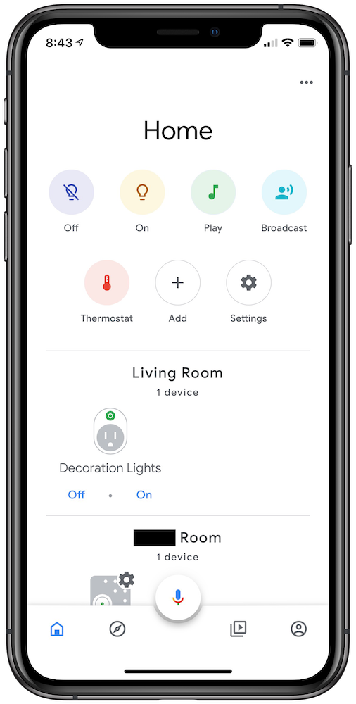
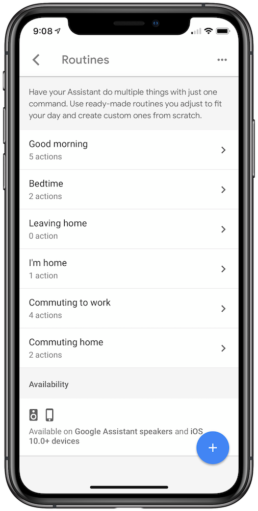
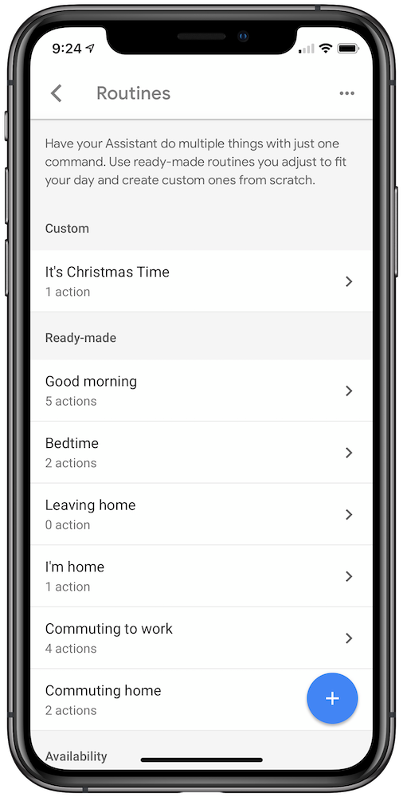

A couple of years ago when we set up our Christmas tree, we bought a cheap little [RF light switch](https://www.amazon.com/Westek-RFK1600LC-Indoor-Wireless-Switch-x/dp/B000HJBE68/ref=sr_1_10?s=lamps-light&ie=UTF8&qid=1543371600&sr=1-10&keywords=remote+light+switch) to plug our tree into so we didn't have to climb underneath the tree to turn on and off the lights.  In the last year, we acquired a Google Home Mini, and I decided we could try to make our Christmas tree experience a little smarter.

After a bit of experimentation, I can now say "Hey Google, It's Christmas Time" and my tree lights up, Christmas music starts playing, and my TV turns on and starts playing a fireplace.  Check it out!

<blockquote class="twitter-tweet" data-lang="en">
&quot;Hey Google, It&#39;s Christmas Time&quot; 🧙‍♂️✨🎄🎶🔥<a href="https://twitter.com/hashtag/GoogleHome?src=hash&amp;ref_src=twsrc%5Etfw">#GoogleHome</a> <a href="https://twitter.com/hashtag/Automation?src=hash&amp;ref_src=twsrc%5Etfw">#Automation</a> <a href="https://twitter.com/hashtag/GoogleAssistant?src=hash&amp;ref_src=twsrc%5Etfw">#GoogleAssistant</a> <a href="https://t.co/G1X0c5d06o">pic.twitter.com/G1X0c5d06o</a>
&mdash; Charlie Chapman (@chuckyc17) <a href="https://twitter.com/chuckyc17/status/1066803500686946309?ref_src=twsrc%5Etfw">November 25, 2018</a></blockquote>

So, let's talk about how I set this up.

## Control the Lights

To start, I want to control the lights through my Google Home, and to do that, I need something that will connect my dumb tree lights to my WiFi, and ultimately Google Assistant.  There are hundreds of smart plugs on Amazon, but you want to make sure you get one that's compatible with Google Assistant.  I got [this one from Gosuna](https://www.amazon.com/gp/product/B072ZX8RTZ/ref=oh_aui_detailpage_o05_s00?ie=UTF8&psc=1), but I think the same instructions will apply with any smart plug.

To set it up, I just plugged my tree lights into the smart plug, and the smart plug into the wall.  I followed the instructions that came with my plug to get it hooked up to Google Home (which included downloading their app) but ultimately you need your smart plug to show up in the Google Home app page like below (I've nicknamed mine "Decoration Lights").

Now you should be able to tap the "On" / "Off" buttons in the Google Home app and see that your Christmas tree lights turn on and off correctly.  You should also be able to say "Ok Google, Turn on the Decoration Lights" and it should control the lights as well.

## Set Up a Routine

So you can now control the tree with your voice, but "Turn on the Decoration Lights" is pretty boring and hard to remember.  So let's make this a bit easier using something Google calls [Routines](https://support.google.com/assistant/answer/7672035?co=GENIE.Platform%3DAndroid&hl=en).

Fair warning, Google has frequently moved things around the Google Home app, and I'm using an iPhone, so these directions might not be exactly the same for your app (let me know if not and I'll try to update this post).

1. From the Google Home main page, tap on the avatar icon on the bottom right of the screen
1. In the "Google Assistant" section, tap on "... More Settings"
1. Tap on the "Assistant" Tab
1. Tap "Routines"

Phew, ok, so hopefully you're now on a screen that looks something like this.

Now, let's create a new custom routine.

1. Tap the blue "+" floating action button on the bottom right
1. Tap the "Add commands" button

This is where you pick the command you want to say to your Google Home to trigger this routine.  So here you can type "It's Christmas Time" and tap save.

*NOTE: You can add multiple phrases to trigger the same routine.  Simply tap the "Add commands" button again and tap the blue "+" floating action button to create another phrase.*

Now, to tell your Google Home what to do when you say this command:

1. Tap ADD ACTION
1. Tap popular actions
1. Check the box next to "Adjust lights, plugs, and more"
1. Tap the settings gear next to "Adjust lights, plugs, and more"
    - Your smart plug should show here
1. Tap on your smart plug
1. Select "Turn on" from the popup menu
1. Tap back
1. Tap "ADD" in the top right corner (I constantly forget this one)
1. Now tap "Save" in the top right corner

You should now be back on the Routines page, but with your new Routine at the top of the list.

You should be able to use this on your Google Home now.  Just say "Ok Google, It's Christmas Time" and your lights should turn on.

## Add Some Music

Alright, now you have a custom routine, but it's only doing one action.  Let's make things more interesting by playing some Christmas music as well as turning on the lights.

1. Tap on your custom routine
1. Tap "ADD MEDIA"
1. Check the "Music" radio button
1. Tap the gear icon next to "Music"
1. And type into the text box "Christmas Radio" (or whatever command you would use to trigger a custom playlist or album)
    - This will use whatever music service you've set up as the default.

Give it a shot.  Say "Ok Google, It's Christmas Time" and your lights should turn on, and Christmas music should start playing out of your speaker.

## Put a Fire on the TV

Ok, this is probably the trickiest one, and may not work for many of you.  Let's start by explaining how I have my TV setup.

I have a Chromecast (1st generation) plugged in to an HDMI port on my TV, but powered by plugging into the wall, not the TV's usb port (this is important).  My TV supports [HDMI-CEC](https://en.wikipedia.org/wiki/Consumer_Electronics_Control), which is a spec that allows devices like BluRay players, video game consoles, and Chromecasts control your TV over HDMI.

In my case, my TV will allow my Chromecast to turn on the TV and switch to the input my Chromecast is connected too.  But it will not allow my Chromecast to turn off my TV for reasons unknown.

If your TV does not support HDMI-CEC then you will have to manually turn on your TV and switch it to the Chromecast's input.

Alright, with that aside, here's how I set up the fireplace within my new Routine.

1. Open your custom routine
1. Tap "ADD ACTION"
1. Type into the text field "Play Fireplace on TV"
1. Tap "ADD" on the top right
1. Tap "Save" on the top right

Typing into that text box let's you arbitrarily type any command you can say to your Google Home.  The way I landed on that command was by trying a bunch of different phrases until I landed on one that would play the fireplace video I want.  If you have multiple TVs in the house, you might also have to specify something like "Play fireplace on living room TV".

Now when you say "Ok Google, It's Christmas Time", your tree lights should turn on, music should start playing from your speaker, and your TV should turn into a fireplace!

## Keep Tinkering

So now that you have the basic building blocks, you should be able to expand on this idea quiet a bit.

You could create a new routine called "Cancel Christmas" that turns off the lights, fireplace, and music.  Or you could add an action to ask Google Home to tell you how many days till Christmas.

Routines are a bit confusing, and the current Google Home app certainly doesn't make that process easier, but it can be really powerful.  Even with just a couple pieces of smart hardware you can build up some impressive workflows pretty quickly.

Hopefully this was helpful!  Please let me know if any of these directions don't work or you have any other ideas.  Best place to reach me is on Twitter at [@chuckyc17](https://twitter.com/chuckyc17).