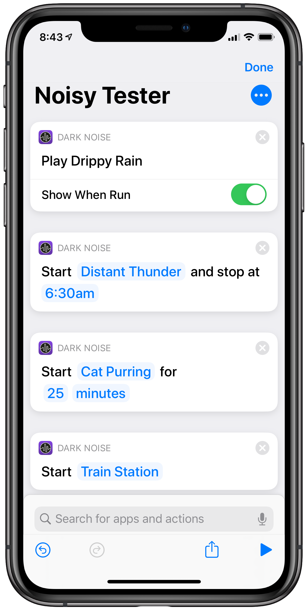

Today I'm releasing the first update to Dark Noise bringing new iOS 13 features and adding a few new sounds.  With Dark Noise 1.2 I've brought 3 main feature improvements:

## Dark Mode

Dark Noise already has multiple themes, including a pure black mode, but I still wanted to take advantage of the new system-wide dark mode in iOS 13.  In Dark Noise 1.2 you can now select a separate theme to use for the system dark and light modes.

This will allow you to quickly switch to a darker theme by hitting the switch in control center, or automatically switch themes based on the time of day using the new system appearance scheduler.

## Parameterized Shortcuts

In iOS 13 Apple added a new feature to Shortcuts that allows users to set parameters for actions provided by apps.  For Dark Noise, this means that you can now create a shortcut action that sets a timer with a user specified time set directly in the shortcuts app.

There's a few unfortunate caveats that I need to address however.  Shortcuts with parameters cannot run audio without opening up the app first (unless you're Apple Music 😒) so any of the new shortcuts will not be able to run in the background.  

For this reason, I'm also including the old style shortcuts that will allow you to run the audio in the background.  The old style shortcuts all begin with the word "Play" and have a toggle for "Show When Run".  Unfortunately there is a new bug (feature?) in iOS 13 that only allows me to add 10 of these so you will see the *most recently played* noises as options in the shortcuts app.

On top of this there is also now a "Play Pause Noise" shortcut that will pause the currently playing noise.  This will work even if the "Mix Audio" setting is turned on which prevents the system level "Play/Pause" action from working.

## Siri

Dark Noise is now integrated with Siri in iOS 13!  This means that without setting anything up ahead of time you can say "Hey Siri, play distant thunder in Dark Noise" and Siri will start the sound.

In the current version of iOS 13, Siri integration is still a bit rough around the edges.  It frequently gets the noise name wrong and will fail to play.  It's also not currently working on the HomePod since, as of the time of this writing, the HomePod software still hasn't updated from iOS 12.  These issues should improve as Apple releases updates throughout the year, but I wanted to make sure I called them out.

## New Sounds

Last but not least, Dark Noise 1.2 has 4 new sounds, each with custom animated icons of course!  This first batch was based on the most highly requested sounds since launch, but I've been collecting all of your suggestions and will keep adding more over time so don't worry if your request isn't included.

Here's the new sounds for Dark Noise 1.2:

1. Cat Purring
2. Spaceship Engine
3. Frogs
4. Distant Thunder

## What's Next?

By far the most highly requested feature since launch is the ability to mix multiple sounds together to create your own personal soundscape.  Now that my iOS 13 update is out of the way, this is my top priority.  

I'm a slow, deliberate developer and this is not my full time job (currently 😏) so it will take some time to do this right.  I've already started [playing around with the design](https://twitter.com/_chuckyc/status/1170390447660949514?s=20) and I would love to hear any feedback or ideas from you all through [Twitter](https://twitter.com/_chuckyc), [Reddit](https://www.reddit.com/r/DarkNoiseApp/), or [Email](mailto:dev.charliemchapman@gmail.com).

You can find the app (as well as a spiffy new app video preview) on the [App Store](https://apps.apple.com/app/dark-noise/id1465439395) today!