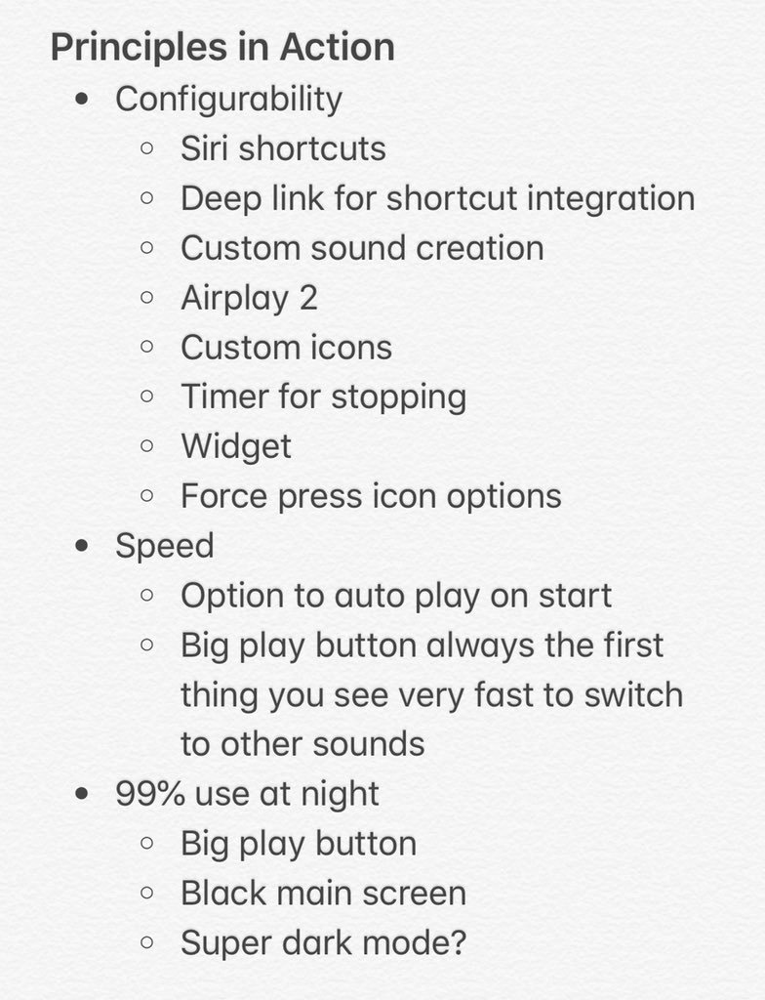
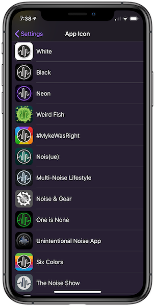

At the beginning of this year I started working on my first indie app to release in the App Store called [Dark Noise](https://darknoise.app).  It's an ambient noise app for iPhone and iPad.

At first, I had a giant list of feature ideas and no idea how to distill them into a focused product. So I started by forcing myself to pick 3 principles to guide the design.

I eventually landed on these core principles:

- **Configurability**
  - Targeting pro users who want as many options and hooks to work the app into their workflow as possible
- **Speed**
  - Opening app to playing sound should be as fast as possible with no compromise since this is the 99% use case
- **Keep it dark** (expect fat fingers)
  - Most users will probably be using this in a dark environment, possibly without their glasses on or half asleep.  Keep that in mind.

After creating the principles, I took my list of feature ideas and tried to slot them all into one of those principles.  If they didn't fit, I tossed them in the backlog.

Keeping these principles in mind as I tried to design and form an MVP was really helpful.  I have a tendency to get overly excited by an idea and drop whatever I'm doing and build it.  Often that's a bad idea, but sometimes it's good!

Whenever I had the thought of adding a bunch of custom app icons referencing podcasts I like, I realized it was something that might actually resonate with the pro users I was targeting.  And seems to have done just that!

This also played into my pricing decisions as that market tends to prefer paying up front and is a little more averse to ads.  That's not to say I won't add a free tier in the future (in fact I probably will) but it's something I'm always keeping in mind as I make these decisions.

Anyway, I'm not an expert at this, heck I'm barely a beginner, but maybe you'll find my thought process interesting nonetheless.

_This post is an attempt to make a more permanent record to [this tweetstorm](https://twitter.com/chuckyc17/status/1158072465739911168) from a few weeks ago._