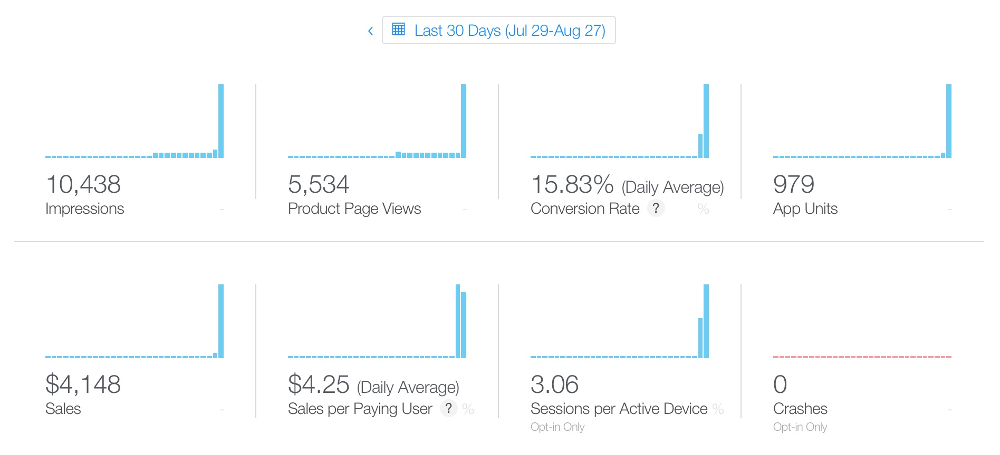

Yesterday's release of [Dark Noise](https://apps.apple.com/us/app/dark-noise/id1465439395) exceeded my wildest expectations.  According to my stats from Apple, the app sold **990** copies which brought in **$4,190** in sales for a take home of **$2,780** after Apple's 30% cut.[^1]

Statistics from App Store Connect

And the reaction from the community has been unbelievable.  Friends and strangers alike have said so many kind words on Twitter, personal blogs, podcasts, and even a [YouTube video](https://www.youtube.com/watch?v=rsGnnwqbJuU)!  And to top that all off, one of my favorite websites, MacStories, wrote up [an amazing review](https://www.macstories.net/reviews/dark-noise-review-ambient-noise-never-looked-so-good/).

A few people have asked me how I got the coverage that I did considering I had essentially zero following and zero connections a few months ago, and my honest _feeling_ is that I didn't do anything special and simply got lucky.  But I think that's kind of a cop-out answer.  

In a recent podcast, Myke Hurley mentioned that he's stopped saying he got **"lucky"** in achieving the success he's had with his company [Relay FM](https://www.relay.fm) and started using the term **"fortunate"** instead.  As usual, I think #MykeWasRight.  

The truth is, I did work really hard and tried _a lot_ of different things.  I have no idea what really worked and what didn't, but I can at least share what I did and explain my mindset.

I'm going to try to write up as much as I can over the next few weeks while this is fresh on my mind, so keep your eyes on this feed if you're curious.  If you have particular questions or topics you'd like me to cover, please reach out to me on [Twitter](https://twitter.com/_chuckyc).

[^1]: I'm sharing this all in the spirit of openness.  I really hope this doesn't come across as bragging and _please_ let me know if it does