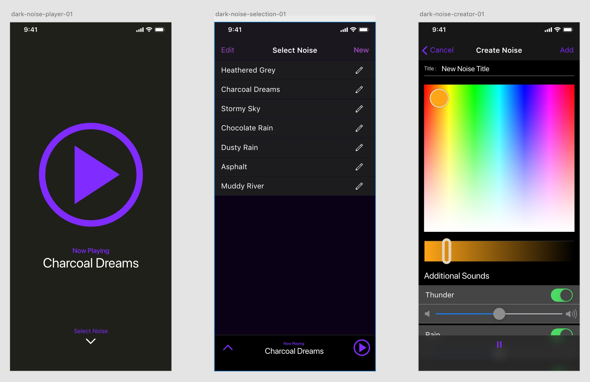

Today I want to talk about the process I used for designing my new app [Dark Noise](https://apps.apple.com/us/app/dark-noise/id1465439395).  I'm not a designer by trade, and this is the first app I've made for iOS, so this is more of a brain dump of everything I did and less of a proposal on how design should be done.

Before I placed a pixel in any design tool, I first figured out what the guiding principles for the app were, and what features I wanted to include.  I detailed this step in a [separate post](https://charliemchapman.com/posts/2019/8/23/principles-of-dark-noise/), but the end result was:

- **Configurability**
  - Targeting pro users who want as many options and hooks to work the app into their workflow as possible
- **Speed**
  - Opening app to playing sound should be as fast as possible with no compromise since this is the 99% use case
- **Keep it dark** (expect fat fingers)
  - Most users will probably be using this in a dark environment, possibly without their glasses on or half asleep.  Keep that in mind.

I have a little bit of experience playing around with [Adobe XD](https://www.adobe.com/products/xd.html), so I decided to use that to build out my mockups.  I ended up loving XD so I'd highly recommend it.  It's even free! [^1]

# Round 1

The first thing I built was a player page based on the 3rd principle: **Keep it dark** (expect fat fingers)

In case you doubted my lack of design pedigree, this was full design, not a wireframe 😅

Once you get passed the blandness, you can pretty much see the bones of the app from the beginning.  An easy to hit play button, a name, and a way to get to the other sounds.

The "Create Noise" page was based on my original idea of generating the different color noises on the fly, and building a little color picker style control to let you mix your own noise.  For technical/scope reasons I ended up not going this direction at all, but I do anticipate implementing a "Create Noise" feature at some point in the future.

I also had the main swiping gesture for minimizing the player there from the beginning.  One cool thing about Adobe XD is that you can quickly setup prototypes with swiping gestures for animations, and then demo them interactively on the phone.  So I could quickly play around with different ideas and get a sense of how they _felt_.

Recorded on my iPhone previewing the XD prototype. I toyed around with having the player minimize to the top.  But the rapid prototyping with XD quickly showed me that didn't feel right

The "Charcoal Dreams" name has an interesting back story.  

From the beginning I knew I wanted to add some sort of fun whimsical feel to the app.  I thought it might be fun to give each noise an obnoxiously whimsical name, and if you 3D touched the name, you'd get a silly description along the lines of "earthy notes with a hint of cinnamon" or something.  

Since I switched strategies to using audio recordings, this didn't make as much sense, but I didn't give up on that goal of having something fun.

    <video class="postVideo"  controls loop autoplay>
    <source src="https://s3.us-east-2.amazonaws.com/media.charliemchapman.com/blog/dark-noise-1st-video.mp4" type="video/mp4">
    Your browser does not support the video tag.
    </video>

First video I could find of a working version of the app.  This was in May, so about 4-5 months in.

This first design wasn't pretty, but the structural bones were pretty good.  It gave me a direction to go to as I built out the first version of the app.

# Round 2

At this stage I actually had a functional app that had a lot of the features I wanted, but it just looked... bleh.  I am not a designer by trade, so I didn't really know what to do to make this look better.  A designer friend at work pointed me to [Mobbin](https://mobbin.design).  It's a simple website that allows you to view screenshots of hundreds of different well designed apps, with a pretty good search functionality.
 
 

Here I'm searching for "Audio Playback" patterns in apps under the "Music" category on <a href="https://mobbin.design">Mobbin</a>

Mobbin helped point me at what elements make up a good looking mobile app, and after iterating on a couple ideas in XD, I landed on a design that will start to look familiar if you've used the app.

This should look familiar.

There are two interesting design details I'd like to call out.  

#### Select Noise Arrow

I really liked the idea of the initial view you see of the app being a super simple page with a big play button, but that meant I had to hide the other sound options behind the second screen.  I ended up with a slightly unusual design that treated the first page you see as a maximized player that you have to swipe down to reveal the rest of the app.  

I was worried it wouldn't be immediately clear _how_ you're supposed to proceed from that page if you wanted to change your noise, so I borrowed a design element from my first MacBook Pro and gave the down arrow a little "breathing" animation.  I'm hoping the gentle bounce and opacity change will draw a new users eye enough to guide them through the app, but also not be an annoying distraction in the future.

#### Icon Animations

One thing I really like about some other audio apps is when it's visually clear when audio is playing so if your speakers are muted you have an indication that sound _should_ be coming out.  For example, in [Overcast](https://overcast.fm), a darker tint color bounces on the pause button along with the audio that's playing to let you know that there is sound being played..

I came up with a few ideas in After Effects, but I either couldn't figure out how to implement it properly, or it just didn't feel right once I implemented it into the app.

    <video class="postVideo"  controls loop autoplay>
    <source src="https://s3.us-east-2.amazonaws.com/media.charliemchapman.com/blog/dark-noise-play-pause-ideas.mp4" type="video/mp4">
    Your browser does not support the video tag.
    </video>

A couple play / pause ideas I tried out.

One idea I had pretty early on was to make a looping animation for each of the static noise icons I was already building.  This sounded fun for me, but I was afraid it would take a long time and not really be worth the time it would take me.

At one point I finally decided to try it out and see how it felt.  I made the animation for the White Noise icon and added it to the app, and it just felt awesome.

I solved my "playing indicator" problem, but even more importantly I found the _fun_ I was looking for that I could use to stamp the app with my personality.

# --Add Video of different animated icons--

# Last Thoughts

There are other small touches throughout the app, but I think this touches on the biggest ones.  Like I said, I'm not a designer by trade, this is just to outline my thought process while I still remember it.  Hopefully this is helpful to somebody out there.

If you have any other questions about my process or design choices, definitely reach out to me [on Twitter](https://twitter.com/chuckyc17) I love talking about this stuff.

[^1]: I actually do have a Creative Cloud subscription, but I believe all that gets you with XD is more storage space and access to their fonts.