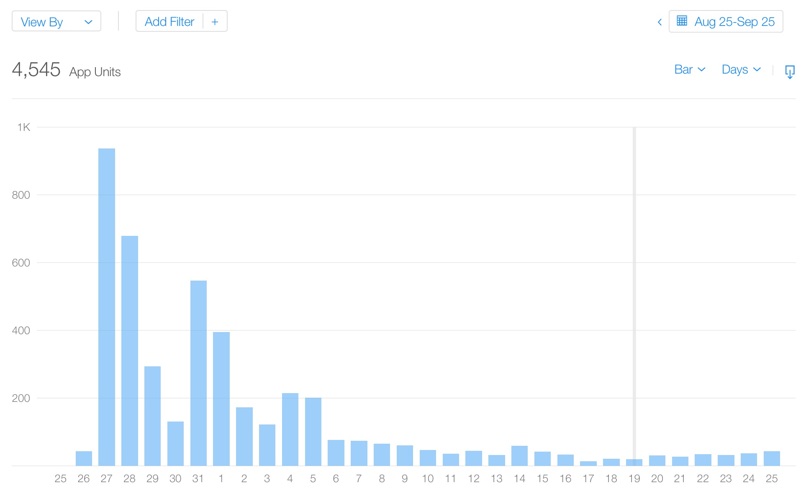
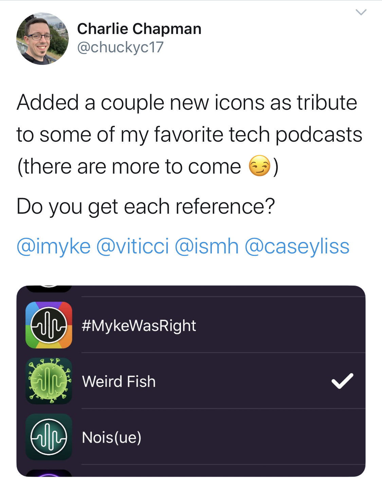
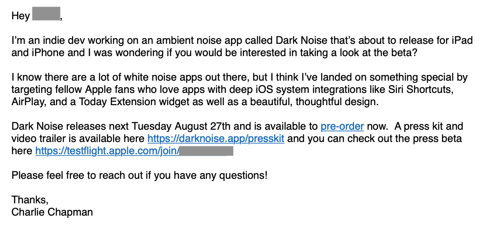

It's been 1 month since I released my app [Dark Noise](https://apps.apple.com/app/dark-noise/id1465439395) in the App Store.  The release went [very well](https://charliemchapman.com/posts/2019/9/4/dark-noise-week-1/), and I've had quite a few people ask how I marketed the app.  I wanted to post this right away, but first I wanted to let the launch stats settle down so you can get a better picture of what the actual results are.

Let's start with some quick 1st month stats.

- 📈 4,545 Downloads
- 💰 $19K Sales
- 💵 $12.6K Proceeds (after Apple cut)
- ⭐️ 212 ratings with a 4.8 avg
- 📝 43 reviews

I'm really happy with these numbers, but they definitely don't paint the entire picture.  Let's look at a graph of unit sales over the first month.

Metrics from App Store Connect

I think launch week went exceptionally well for a first time developer, but sales have settled down to averaging around the 20-30 downloads a day range.  I'm sharing this to give some context around what the marketing of Dark Noise produced.  

Alright, now that the context is out of the way, let's get to the goods.  Don't think of this as advice as much as it's a document detailing everything I did to help market Dark Noise.

### Private Beta

Once I had a usable app that could successfully play a few white noise sounds *and* I was confident enough that I was actually going to release the app, I enrolled in the [Apple Developer Program](https://developer.apple.com/programs/) and opened up a private beta through TestFlight.

Initially I targeted a single user, my sister, and made sure it had a sound I knew she listened to at night.  Her first request was for a timer, and almost immediately it was helpful talking to a real person using the app.

Over time I slowly added people to the beta, collecting feedback and bug reports.  It was surprisingly difficult to show people the app at this early rough stage, but I cannot express how valuable it was.

Getting early feedback allowed me to make some design changes before I went too deep in one direction.  Just as importantly, it helped me squash a lot of little embarrassing bugs **before** opening the beta to a wider audience.  

There was also a higher level of engagement per user at this stage, since everybody was either a person I knew, or someone who had to explicitly ask for an invite through Twitter.

### Public Beta

Once I had the app in a state I felt was worthy to really start showing off, I opened the beta to the public.  I sort of treated this stage like a soft launch of the app.  I had a lot of work I wanted to do, but I treated these users as if they were customers and I created an [app Twitter account](https://twitter.com/darknoiseapp) to tweet out updates and respond to user feedback.  I launched the beta on July 9th, so about a month and a half before the actual launch.

Opening the beta to the public early was definitely one of the best decisions I made.  The feedback from users was invaluable, and I built up an excited audience, who was invested in the app by launch.  This really helped build up some pre-launch hype, and I received a lot of reviews and tweets on launch day from people that started with "I've been on the beta for a while...".  I believe this lent an air of credibility that I wouldn't have had otherwise as a brand new developer.

The last note I'd like to make on the public beta is that I really tried to show beta testers how much I appreciated their help.  I tried to respond to emails quickly, but also conversationally.  If they sent me an idea I didn't plan on implementing, I tried to explain why.  And when people sent bugs or features I used, I tried to express how thankful I was both in my response, and also by adding a little personalized thank you in the beta release notes.

### Twitter

Probably the biggest contributing factor to the successful launch of Dark Noise was the excitement I built leading up to the launch through Twitter.  

While working a feature I'd usually tweet about the progress and hype up the next beta release if there was something coming.  Frequently people would chime in with feedback or suggestions that I could incorporate immediately.  This both made the app better and also gave those who engaged on Twitter a little slice of ownership in the app.  This is one of those things that only an indie app can pull off, and I think it's part of what makes people love them so much.

One feature that really blew up was the custom app icons.

Open tweet in Twitter <a href="https://twitter.com/_chuckyc/status/1154771704952098816">here</a>

Earlier this year I saw David Smith add a tribute to Myke Hurley in his app [CalZones](https://apps.apple.com/us/app/calzones/id1451728473) by creating a theme called #MykeWasRight (the name of his old Tumblr blog) as a thank you for some help in the early stages of the app. I love Myke's podcast [Cortex](https://www.relay.fm/cortex) that he hosts with CGP Grey so I thought it might be fun to add a similar tribute to my app in the form of a custom icon.

This idea really excited me and I ended up running with it and creating a bunch of custom app icons for a lot of tech podcasts I really like.  When I tweeted about it, it seemed to really strike a chord with my fellow Apple tech nerd followers and generated a little buzz, enough so that it even came across the radar of Federico Viticci, Founder and Editor-In-Chief of the incredible [MacStories](https://www.macstories.net).  I don't actually know this for sure, but I suspect that this is what led to Ryan Christoffel finding the app and eventually writing up a [review on MacStories](https://www.macstories.net/reviews/dark-noise-review-ambient-noise-never-looked-so-good/).

I'm not sure what the lesson here is.  In my case using social media to build up an audience and hype up new features really paid off.  I think attempting to fish for *"influencers"* attention is something that will almost certainly backfire, but if you're excited about what you're making and you talk about it enough in a genuine way, you might eventually get the attention of someone who can really make a difference.

### Press Kit

I don't have a whole lot to say about this.  I made a press kit.  You can check it out [here](https://darknoise.app/presskit).  I don't know if it's a good one, or a bad one.  I do know that it was helpful for a few people who ended up writing a day one post about Dark Noise, specifically the screenshots and hero images.

<iframe style="width:100%" width="560" height="315" src="https://www.youtube.com/embed/Q7BDtu9CkAI" frameborder="0" allow="accelerometer; autoplay; encrypted-media; gyroscope; picture-in-picture" allowfullscreen></iframe></iframe>

I also made this little promo video.  To be honest, this was an indulgence for me as I love motion graphics and needed a break one evening.  I didn't really make it for marketing purposes, but I did end up using it in my "official" announcement tweets for the Dark Noise Twitter account and pinned that tweet.  I've gotten a few comments from people that it lends a credibility to the app since it looks pretty professional.

I also *should* add this to the top of my website, but I still haven't gotten around to that. 😬

### Contacting Press

I don't think I did the *best* job with reaching out to the press, but I did end up getting a few articles written about Dark Noise.  Here's a quick list of launch articles from both traditional tech websites and some personal tech blogs:
- **MacStories** - [Dark Noise Review: Ambient Noise Never Looked So Good](https://www.macstories.net/reviews/dark-noise-review-ambient-noise-never-looked-so-good/)
- **Knapsack** - [Dark Noise is the white noise generator you need](https://knapsack.news/2019/08/27/dark-noise-is-the-white-noise-generator-you-need/)
- **App Advice** - [Dark Noise is the Ambient Noise App You've Been Looking For](https://appadvice.com/post/dark-noise-ambient-noise-app-youve-looking/765988)
- **Chambyte** - [Dark Noise: A Refined White Noise App with a Liquid Smooth Design](https://chambyte.net/darknoise-a-refined-white-noise-app/)
- **Peer Reviewed** - [Dark Noise — a Simple, Beautiful Ambient Noise App for iOS](https://www.peerreviewed.io/blog/2019/8/27/reviewed-dark-noise-a-simple-beautiful-ambient-noise-app-for-ios)
- **The Dent** - [Dark Noise - Simple, Powerful, Beautiful](https://thedent.net/2019/08/27/dark-noise-simple.html)

One thing I haven't mentioned yet is that I selected a release date about a month beforehand.  Not only did this help *me* with forcing myself to stop adding features and drive towards polishing up what I had, but it also allowed me to give the press a hard target for when to expect the app to come out.

Once I had the app in a state I felt wasn't embarrassing, and I set up my press kit and website, I started contacting the press.  Basically I just went to a bunch of websites I like, and found the emails of writers there that had covered apps before.  I started doing this about 3-4 weeks before releasing that app, but continued pretty much up to launch day as I thought of different publications to reach out to.  I emailed them with a short pitch of the app, a release date, and a link to the press kit.

Here's an example of an email that I sent out to the press.

I received a few "thanks I'll check it out" responses, but that was basically it.  I believe pretty much all of the press I received on launch day was due to attention and relationships I made during the months of development through Twitter and the public beta.

While writing this article I reached out to a few members of the press and asked them if they had any advice for app developers.  The main takeaway seems to be that you should make your pitch short but clear, and then include relevant information like price, release date, and a link to your press kit with all the assets and images a writer would need to make your app look as good as possible if they do a write-up (specifically high resolution app icon was called out more than once).  This quote from [Victor Marks](https://twitter.com/vmarks?ref_src=twsrc%5Egoogle%7Ctwcamp%5Eserp%7Ctwgr%5Eauthor) really sums it up well:

> Basically, I need 650 chars to 400 words telling me who it’s for, what it does better, and images and icon to work from with a link to your site and the App Store. Write like we’re friends or you want to be friends, not “professional pr voice”. For the love of god, tell me whose problem you're solving and why it wasn’t adequately solved before.

Looking back at my emails I don't think I articulated my sales pitch very well, and that may have contributed to the lack of interest.  Talking to other devs, this seems to be a pretty common outcome, so don't get discouraged if you never hear anything back.

### Pre-Order

About a week before launch day I submitted the app to the App Store and once it was approved, I released it for pre-order.  My thinking was that I would build up a list of day one purchasers which might help boost my ranking in the store.  I'm still not clear on whether pre-orders actually helps your ranking though.

You can also still submit a new version while pre-orders are open, so I actually made a few updates after I released for pre-order and submitted a new version before the real release day.

One interesting thing to note about pre-orders is that they release around midnight in the users local time.  So customers who pre-ordered in New Zealand will have the app released to them the day before everyone in the United States.  For me it was actually kind of fun watching the app make it's way around the globe through users on Twitter, but it's something you'll want to be aware of.

### Launch Day

This may sound cheesy, but launch day for Dark Noise is a day I'll never forget.  It was kind of a whirlwind but so much fun.  I took the day off of work not really sure what to expect, and I'm really glad I did.  

First thing in the morning I posted an [article on my blog](https://charliemchapman.com/posts/2019/8/27/dark-noise/) about the release and made announcement posts on Twitter and Facebook.  Once the press coverage started coming in user feedback and questions on Twitter really picked up.  I spent the majority of the day retweeting positive comments and answering questions on Twitter.  I tried to do my best to make it feel like a big splash, so anybody who followed the app account or me would see a lot of activity on that one day.

Aside from responding to people and generally trying to make the launch as noisy as possible, launch day was mostly just watching.  I kept waiting for some embarrassing bug to come up that I'd have to scramble to put a release out for, but it never came.  And since Dark Noise is currently completely offline, I didn't need to watch over any servers. 

### Podcasts and Blog Posts

Everything I've talked about so far has pertained to marketing Dark Noise specifically, but there is actually another piece to this.  Since I'm completely new to the iOS dev scene, I wanted to establish myself with this community.  The bulk of that was done through engagement on Twitter, but I also guested on multiple podcasts and wrote up a few blog posts like this one.

I didn't really do much active work to get on the podcasts, just [tweeted](https://twitter.com/_chuckyc/status/1156990696047423488?s=20) out that I was available and accepted basically any invitation I got. 😆 I'm not sure how effective these were at promoting Dark Noise specifically, but I still think it was worth it for the relationships it helped build and (hopefully) helping establish my voice in the community.

### Odds & Ends

I tried out App Store Search Ads, but personally I didn't find them very effective.  I'm just using the "Basic" ads, so I'm not really doing much work to make them effective, but just want to call that out.

I also [posted to /r/Apple](https://www.reddit.com/r/apple/comments/cxvg0c/i_released_a_white_noise_ios_app_this_week_with/) on Reddit which did very well and drove a lot of sales.  They (currently) allow developers to post about new apps on Saturdays, but definitely read their rules before posting.

With regards to feedback, I've tried to respond to people as quickly as possible whether through Twitter, the [Dark Noise subreddit](https://www.reddit.com/r/DarkNoiseApp/), or email.  I've gotten a number of 5 star reviews that specifically call this out, so I think it's paid off.

### Wrap Up

Hopefully this is helpful for some of you.  I think I've captured most of the marketing efforts I made for Dark Noise, but I may update this post if I remember something else.

If you have thoughts on anything I talked about here, or marketing ideas that have worked for your app, please reach out to me on Twitter at [@_chuckyc](https://twitter.com/_chuckyc).  I love talking about this stuff!