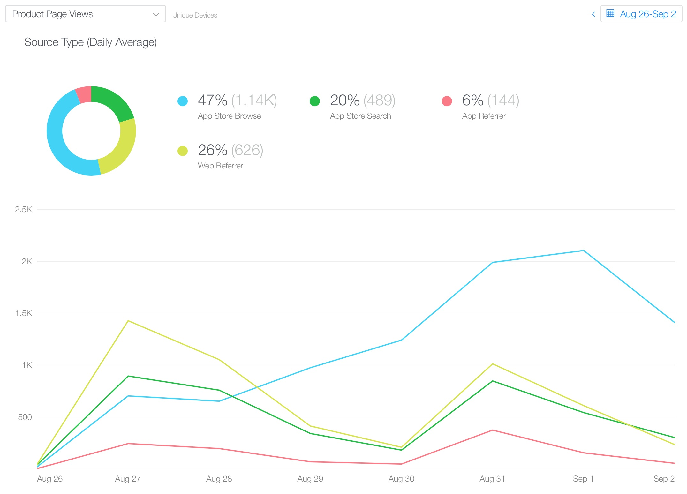

Week 1 of [Dark Noise](https://apps.apple.com/app/dark-noise/id1465439395) is in the bag!  Here's some quick stats of how the week went:

- 📈 3,192 Downloads
- 💰 $13.5K Sales
- 💵 $8.99K Proceeds (after Apple cut)
- ⭐️ 69 ratings with a 4.86 avg
- 📝 24 reviews

In ranks Dark Noise peaked at:
- 2nd in Health & Fitness on iPad
- 5th in Health & Fitness on iPhone
- 77th in Top Apps
- 162nd in Top Overall (includes games)

I just wanted to give a brief breakdown of some of the metrics gathered from the first week of Dark Noise being released in the store, and some of my (very amateur) thoughts.  Hopefully if you have an app release incoming, this might be helpful in setting expectations or at the very least be interesting 😅.  This is mostly just me sharing my experience rather than giving advice, so take any theories I have with a heavy grain of salt.

Metrics from App Store Connect

The app launched on August 27th, but notice I have a few sales from the 26th?  That's because I used Apple's pre-order feature, which it turns out will release the app around 12:00am the morning of release date in **local time**, presumably based on which regional App Store the pre-order was made from.

Since App Store connect appears to update metrics based on midnight California time, anybody who pre-ordered or downloaded the app right away from east of the US such as New Zealand or the UK, will show up on the 26th.

Anyway, let's look at the numbers.  Day 1 was easily my biggest sales day.  I believe this was mostly made up from the small community I had built up through the beta testing period and some press I received including a wonderful [review on MacStories](https://www.macstories.net/reviews/dark-noise-review-ambient-noise-never-looked-so-good/). So let's look at the sources!

Sources for App Store page views

Sources for App Store page views that lead to units sold

I think the combination of **App Store Search** and **Web Referer** lines up with people following direct links from reviews and social media, as well as people searching directly for Dark Noise after seeing it somewhere else.

At first, there seemed to be a pretty strong correlation between page views and units sold, but as the week progressed, *App Store Browse* page views started climbing, but didn't seem to have much of an impact on sales.  I believed this might be linked to the App Store ranking.  So let's take a look at the rankings!

Week 1 rankings provided by <a href="https://appfigures.com">appfigures</a>

I was wrong! Ranking actually seems to be pretty correlated with unit sales instead.  So I have no idea why my **App Store Browse** page views started climbing so much to seemingly no effect 🤷‍♂️.  Dark Noise was just added to the top of the [Apps We Love Right Now](https://twitter.com/chuckyc17/status/1169058911124635648?s=20) list on the US app store but that was after the week 1 date range we're looking at here.

Now let's talk about that second spike on Saturday.  That was the day I posted about Dark Noise to [/r/Apple](https://www.reddit.com/r/apple/comments/cxvg0c/i_released_a_white_noise_ios_app_this_week_with/) on Reddit.  

That subreddit is huge, and they allow app devs to post announcements about their apps on Saturdays.  I read about this a while ago, set a reminder on my phone for the Saturday after I was planning to launch, and promptly forgot about it until my phone reminded me Saturday morning.

The post ended up going to the front page pretty quickly gathering 1,500 upvotes and hundreds of comments which had a pretty clear impact on sales.  If you've got an app coming soon, I cannot recommend this enough.  You can see the results right here!

I don't have much more analysis, but here are some other metrics that you might find interesting.  And as always feel free to reach out on [Twitter](https://twitter.com/chuckyc17) if you have any questions or metrics you're interested in seeing.  I like sharing and comparing this data as it really helps me understand the market better, especially as a newcomer.

App Units by Territory

App Units by Device
