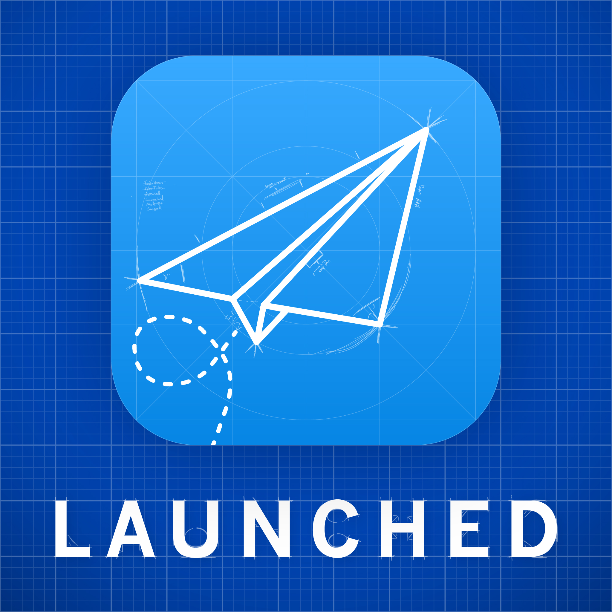

Today I'm really excited to be releasing the first episode of my new podcast [Launched](https://launchedfm.com).  Here's the pitch: 

> Launched is a fortnightly show where I interview app developers and other creators about their experiences releasing their creation out into the world.

Last year while I was working towards the release of [Dark Noise](https://charliemchapman.com/posts/2019/8/27/dark-noise/) I found that listening to developer interviews on podcasts was extremely helpful in preparing me for what to expect and giving me ideas on how to build a marketing plan around the release.  My hope is that Launched can be a resource for aspiring creators by providing a platform for people to share their experiences launching something into the world.

I'm pretty excited to see where this goes! Rest assured I'll be posting updates with stats and I'll try to do a post outlining everything I've done to try to market the show similar to what I did with the [Marketing Dark Noise](https://charliemchapman.com/posts/2019/9/27/marketing-dark-noise/) post.

If this sounds interesting you can find links to [subscribe here](https://launchedfm.com/subscribe). And if you enjoy it **please** consider giving me a rating or review in [Apple Podcasts](https://podcasts.apple.com/us/podcast/launched/id1491582246)

You can also follow the show on Twitter at [@LaunchedFM](https://twitter.com/launchedfm) and check out the dedicated Subreddit [/r/LaunchedFM](https://www.reddit.com/r/LaunchedFM/) to talk with other listeners about the show.

And if you're a creator who's recently (or soon to be) launched something and would like to tell your story, you can [apply here](https://docs.google.com/forms/d/e/1FAIpQLSfxduoOnjnF_qE6PpnEGdKewWHvB3YDl0gv3WAxAJ4HDVq8Bg/viewform) to potentially come on the show.