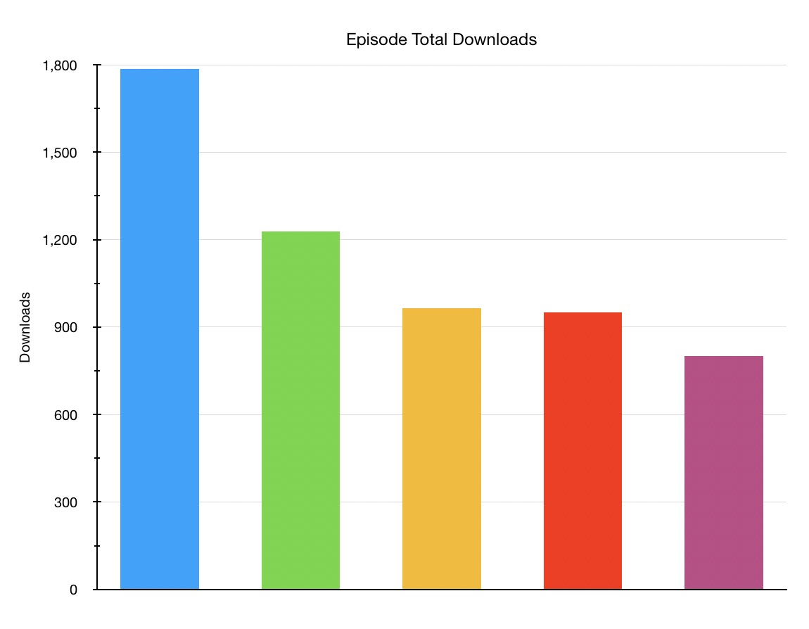
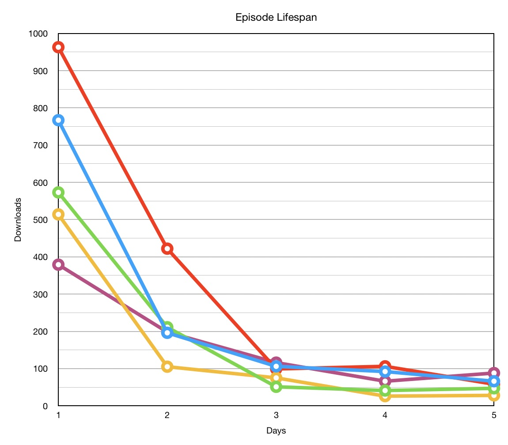
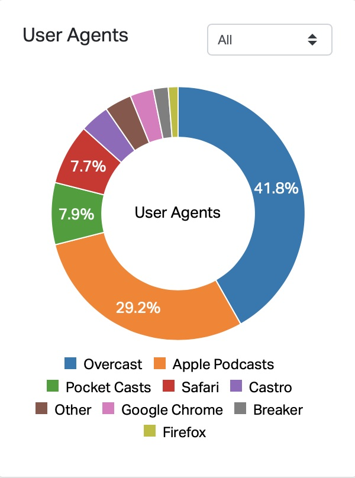
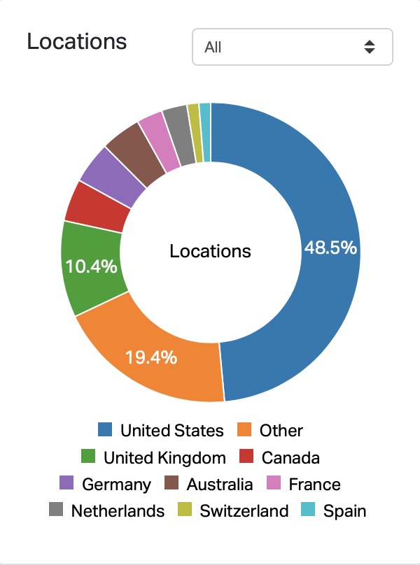

Last week I launched my new podcast [Launched](https://charliemchapman.com/posts/2020/1/13/introducing-launched/) and I wanted to share a little bit about how I went about creating the show similar to what I did with my posts about [designing](https://charliemchapman.com/posts/2019/9/2/designing-dark-noise/) and [marketing](https://charliemchapman.com/posts/2019/9/27/marketing-dark-noise/) my app [Dark Noise](https://apps.apple.com/us/app/dark-noise/id1465439395).

But before I write that up I want to share some stats about how week 1 went. I'm very happy with how it's been received so far, but honestly I don't know the podcast world enough to tell you if these numbers are _good_ or not (though they are significantly better than _my_ previous podcasting efforts 😅).

As I'll explain in a later post, I released 1 episode a day all week, so there are 5 episodes included in these stats. Here's the quick rundown:

- ⬇️ 5,727 total downloads
- ⬇️ 1,047 average downloads per episode
- 📖 13 Reviews
- ⭐️ 22 Ratings

### Downloads

Because it's an interview show, there is expectedly quite a bit of variance betwen episodes. I don't think it's fair to guests to share stats attached to their names, so I'm not labeling which episode is which.

Total downloads per episode after week 1 (in order of downloads)

Downloads per day per episode

It's really hard to make to many assertions based on this data so far.  There's a lot of variables from the guest down to the day of week the episode went live.

### Demographics

Let's look at some demographics.

Apps used to download episodes. Spotify not listed here but only has 119 "starts" which sets it between Breaker & Firefox

Where episodes were downloaded from.

Two things stand out here. Overcast is dramatically over represented compared to my understanding of the industry average. This makes sense given the more tech (and Apple specifically) target audience, but that's still pretty striking. It makes me happy that a large portion of the audience is using a player that supports the chapters and custom artwork that I put a decent amount of work into. 😊

I'm also pretty pleased that the rest of the world just edged over 50% vs the United States. It really makes me goofy smile to know that there are people all over the world listening to something that I'm making.

### Wrap Up

The only other metrics that may be interesting are the social network numbers. The podcast's [Twitter account](https://twitter.com/launchedfm) has 395 followers which I'm pretty happy about. And the subbreddit [r/LaunchedFM](https://www.reddit.com/r/LaunchedFM/) has 63 members which... isn't much in Reddit terms. I'll talk about this more on an upcoming post, but I'm not sure Reddit makes as much sense for a show of this size as I was originally thinking it would.

If you're curious about any other metrics please don't hesitate to ask me on [Twitter](https://twitter.com/_chuckyc). I like to be as much of an open book as I can on this stuff.

And hopefully I'll get a post up _relatively_ soon walking through the development and marketing process of Launched!