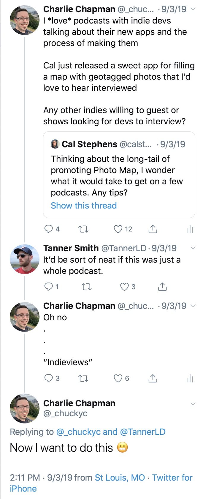
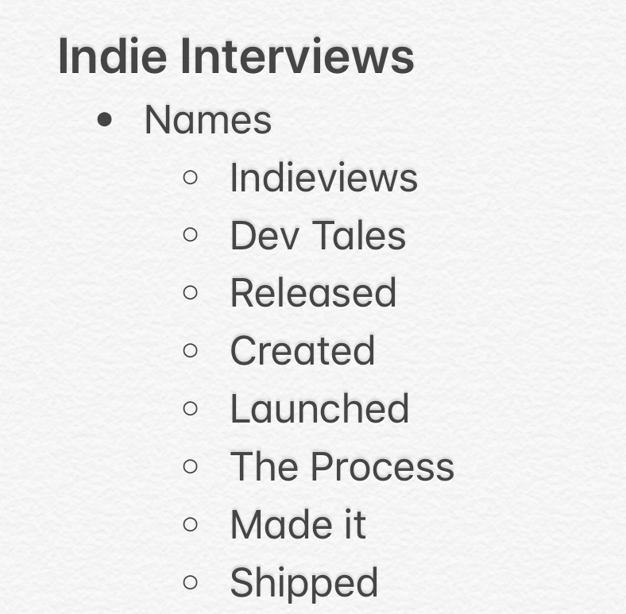
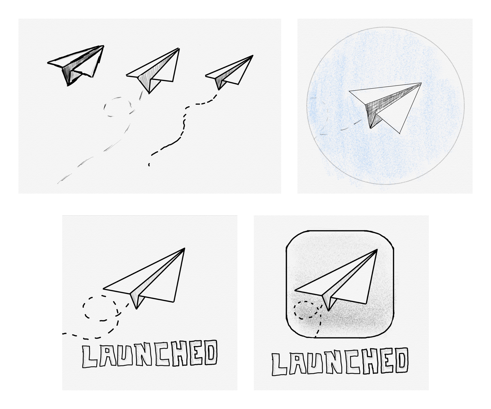
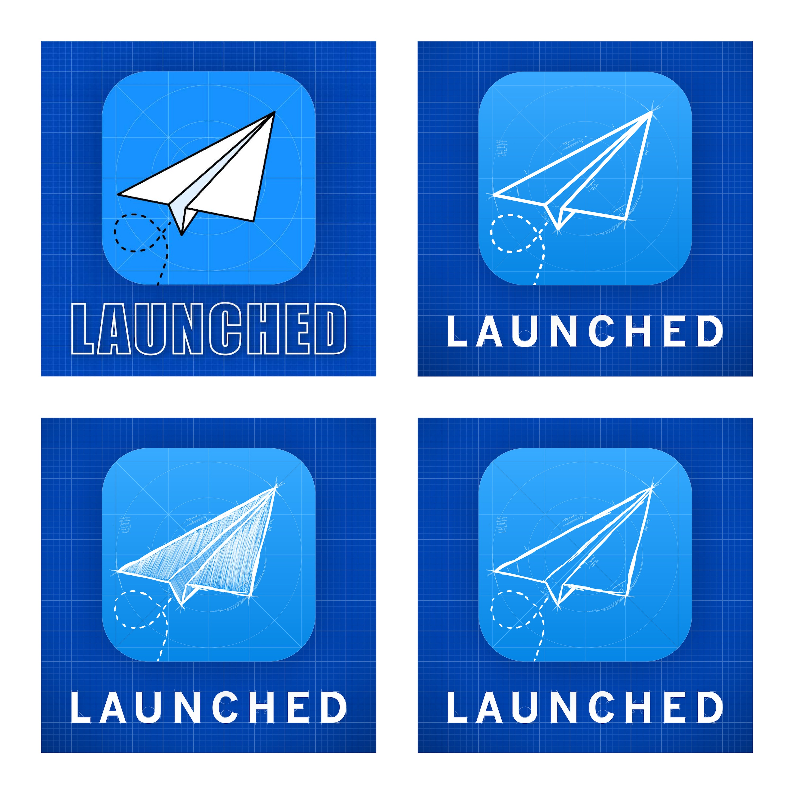
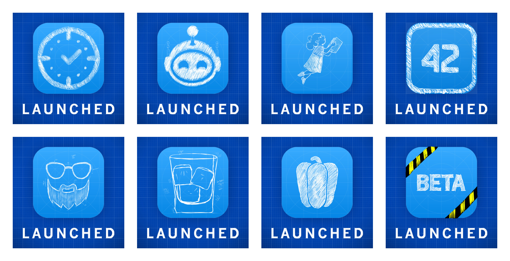

After launching my new podcast [Launched](https://charliemchapman.com/posts/2020/1/13/introducing-launched/) last week, I'd like to share basically everything I did to design, structure, and plan the launch of the podcast. This will probably be overly long so, uh, buckle up.

I'm not pretending to be an expert at this. I just want to share everything I tried with the hope that it may help others in the future (and so I don't forget 😅). Check out my previous post outlining the [week 1 stats](https://charliemchapman.com/posts/2020/1/21/launching-launched/) to get a sense of what kind of results I ended up achieving with my approach.

I'm also not going to be talking about the technical aspects of recording a podcast. The purpose of this post is to talk about designing and launching the podcast, but I _would_ really like to write about my recording set up and editing workflow at some point. If that sounds interesting to you let me know [on Twitter](https://twitter.com/_chuckyc) and I may bump that up on my priority list.

### The Idea

Let's start at the beginning. Last year while building my first app [Dark Noise](https://charliemchapman.com/posts/2019/8/27/dark-noise/) I ran across a series of interviews that [Heidi Helen Pilypas](https://twitter.com/heidi_helen) did after launching her app [When Did I?](https://apps.apple.com/us/app/when-did-i/id1463692593?ls=1) that I found extremely useful in preparing my own launch.

A few months later, this four Tweet thread pretty much kicked off the show in my mind.

The idea of an interview show that could feed off of the constant stream of interesting new apps coming out was really intriguing. I wanted this to exist, and I thought I might be able to actually pull it off.

### Why tho?

Any project that's going to require a significant investment of your time deserves to have this question answered: Why? For me, there is one "altruistic" answer and two selfish ones.

1. I want this to exist and genuinely think other devs and creators would find it beneficial.
2. I think it could help me raise my profile in the community which would help with future app launches and all the nice benefits of having a strong network.
3. I'd get to meet and talk to a bunch of interesting people who's work I really respect.

My understanding is that the vast majority of podcasts fail to reach a substantial audience, so 1 and 2 may never happen.  But 3 is a benefit I get either way, so in the end I felt it was worth giving it a shot.

### Choosing a Name

Naming is hard. I think this is a truism in basically every discipline (except Sony game consoles 😉).

For this show, I wanted a very simple word that conveyed the idea releasing an app. I knew early on that I didn't want it restricted to only app developers, so I wanted to keep it a little more vague while still conveying that idea. Here's my note with the names I was considering:

**Launched** fulfilled all of my checkboxes. It was one word, vague enough to allow for interviews with people in all sorts of industries and disciplines, and it wasn't already taken in Apple Podcasts (though "Launch" was). It also just sounded _cool_.

### Logo

Once I had a name, I needed a logo. I think the logo for a podcast is actually really important. It's basically your one shot at convincing someone to try out the show, and it's your only real visual connection you get to make with most of your audience once they subscribe. It also gives me something tangible to hold on to while developing the project that makes everything feel more real.

A name like launched immediately conjured up images of rockets but I felt like that wouldn't stand out as much as there are a lot of space podcasts with rocket logos that seem to overlap audience with the technology category. I also toyed with the idea of a shipping container but couldn't find something I liked.

I landed on the idea of a paper airplane. I liked the idea of it being a smaller, handcrafted item as I knew most of my guests (and audience) would be indies. And while there are a million email apps that use a paper airplane icon, I didn't see any other podcasts using it as their icon.

I started by sketching some ideas in the wonderful [Linea Sketch](https://linea-app.com/sketch) app by The Iconfactory.

Early artwork concept sketches made in Linea Sketch.

After asking for feedback on Twitter I got an unexpectedly strong positive reaction to the "sketch" look. I was originally thinking of going with a cleaner style, but I thought a rougher look would actually fit with the theme of the show being about people creating something new.

I also really liked encasing the icon in the [iOS squircle](https://applypixels.com/blog/the-hunt-for-the-squircle). I knew I was going to want to make custom artwork for each episode (we'll get to that later) so I figured this would give me an easy spot to place custom assets.

I wanted a strong color rather than black and white sketches, so I started playing around with a blueprint look. This would still fit the rough sketch style but also give me a strong pop of color to hopefully stand out in podcast apps.

Different variations I tried of the paper airplane artwork design.

I ended up going with the simple clean outline with various sketch marks on it (top right). I don't really have a good reason other than it _felt_ the nicest.

#### Custom Episode Artwork

I love shows that make custom artwork for each episode so I wanted to do the same for Launched, but I knew I'd need to come up with a system that allowed me build them quickly. If it was cumbersome to make, I knew I'd be angry at myself in 4-6 months when the novelty of the show had worn off and it started getting overwhelming.

Some of the custom icons I created for Launched episodes. The "Beta" artwork is used for the draft episodes I send to guests to let them listen and ask for edits if they want. The glass of ice is used for the "Ice Breaker" chapter in each episode.

The iOS icon provides a nice frame that I can swap in a hand drawn style of an app icon or symbol that represents the guest of that week. It's also extremely fast for me to create these using [Photoshop](https://www.adobe.com/products/photoshop/ipad.html) on my iPad Pro and Apple Pencil. I can just duplicated my existing Photoshop psd file, grab an image of the icon from the internet, and trace over it with the pencil.

    <video class="postVideo"  controls loop>
    <source src="https://s3.us-east-2.amazonaws.com/media.charliemchapman.com/blog/launched-icon-speedrun.mp4" type="video/mp4">
    Your browser does not support the video tag.
    </video>

Timelapse of my process creating the custom artwork for each episode using Photoshop for iPad.

It only takes a few minutes to put most of them together and I think the style looks really interesting and fits the whole theme of the show. It also _could_ make for an interesting custom app icon if any developers that I interview wanted to sneak it in their app. 😉

**Note:** It's important to point out that I'm asking everyone if it's ok to use their logo. Most people have been fine with this, but there are cases where people aren't comfortable or even legally can't for trademark reasons so keep that in mind if you ever want to try something similar.

### Structure

With a name and logo out of the way, I was ready to start putting together the structure of the show. Starting at the highest level, I needed to pick a schedule. While I might be able to sustain weekly for a short amount of time, the complexity of scheduling new guests in different timezones every episode is too much for me to attempt weekly. So I landed on a **target** of every other week.

**Side Note:** The app [CalZones](https://david-smith.org/blog/2019/04/17/introducing-calzones-a-timezone-savvy-calendar/) by David Smith has proven to be extremely useful scheduling all of these interviews across many different timezones. I've also been told [Calendly](https://calendly.com) is very good for this as well but I have not tried it yet.

I don't actually listen to a lot of interview shows so I wasn't sure what the best approach would be to structure the episodes themselves. I knew that I wanted them to be conversational in tone but I wasn't sure how to keep things from feeling too _stiff_ since most of the time I would be speaking to people for the first time.

I happened to be chewing on this problem while listening to an episode of [Upgrade](https://www.relay.fm/upgrade) where they start each show by asking one of the hosts, Jason Snell, a random question given by the audience. They're often off the wall questions like "When putting in AirPods which ear do you put in first?" This often leads to a funny conversation that get's the episode going with a fun energetic vibe.

I decided to co-opt that idea as an ice breaker question and so far (5 episodes in) I feel like it's succeeded in building a little rapport with the guests before getting into the episode.

The bulk of the episode is outlined on a per episode basis using research on the particular guest and letting the natural flow of the conversation guide me from section to section.

At the end I'm asking each guest for a person who's been an inspiration for them that they want to shout out and recommend others follow. This serves two purposes:

1. I want to use this podcast as a way to elevate people making cool things and this is a way to add to that.
2. I selfishly want to find more cool people to follow and potentially try to get on the show. 😏

So this leaves the general show template like so:

1. Intro
2. Ice Breaker
3. Guest specific stuff
4. Guest's inspiration
5. Where to find guest (Twitter/website/ect)
6. Outro

It'll be interesting to see how this changes over time, but so far I've been happy with the balance of structure and loose conversation.

### The Launch

My understanding with podcasting is that consistent output is the best way to grow an audience. If you don't have a big pre-existing following (which I did not) launch day is not really that important. Despite this, I figured I'd try to come up with something to make as big as a splash as I could at launch hoping this would help boost numbers which would make it easier to occasionally book bigger guests, which in turn would help boost numbers... ect. ect.

A few years ago, a motion designer named [Joey Korenman](https://twitter.com/jkorenman) started a series of After Effects tutorials called [30 Days of After Effects](https://www.schoolofmotion.com/collection/30-days-of-after-effects) where he posted a brand new After Effects tutorial every day for 30 days straight. Tutorials are really difficult to put together so this wasn't something that I had ever seen before and it's always stuck with me how quickly that intense burst of output catapulted his brand, [School of Motion](https://www.schoolofmotion.com), into the limelight.

I decided to try a similar approach with Launched but at a smaller scale. Not only was 30 episodes in a row way more work than I could manage, but I don't think most people would actually want 30 episodes clogging up their podcast queue that quickly. So I settled on 1 business week of 1 episode a day to kick off the show. This would hopefully generate some buzz as well as give listeners multiple episodes to hear in a row to decide if they liked the show, rather than one and done.

On the advice of [Matthew Cassinelli](https://twitter.com/mattcassinelli/status/1199107531311726593?s=21) I also created a short teaser episode and released it a month before launching the show. This ensured the podcast was properly set up in all of the major podcast directories and players, and also gave me a small list of subscribers who would get the first episode immediately after release.

I also Tweeted a lot about the journey leading up to the launch of the show as has apparently become my _thing_. 😅 This may not be broadly applicable advice but I do think it helped build up a sense of excitement around the launch, and helped make more people invested in its success.

### Wrap Up

I'm really happy with how the launch of the show turned out.  I'm proud of the episodes released so far and I'm so excited to keep making more and develop the show over time.  Hopeful this post was helpful or at least interesting for you. If you'd like to talk about anything related to this you can find me on Twitter at [@_chuckyc](https://twitter.com/_chuckyc).