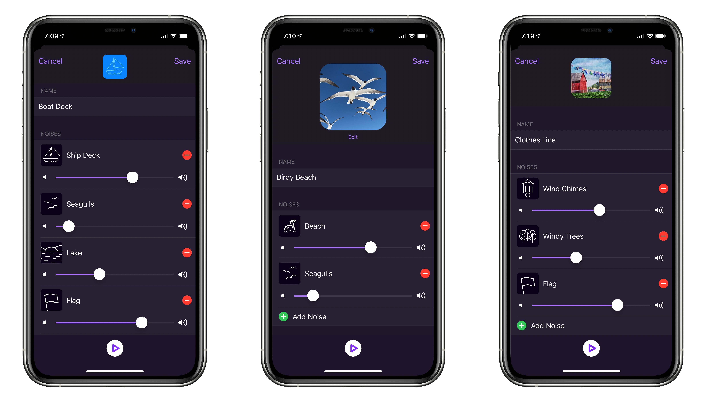
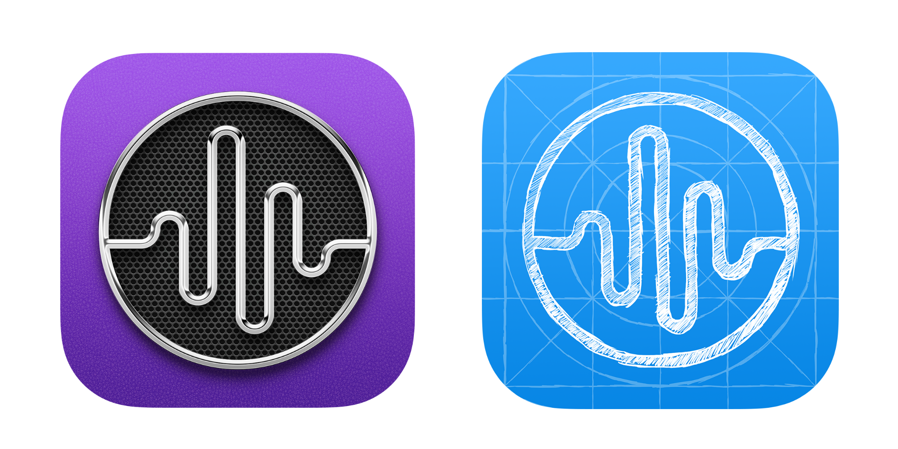

    <iframe width="100%" height="100%" src="https://www.youtube.com/embed/D4dbuYqoHmA" frameborder="0" allow="accelerometer; autoplay; encrypted-media; gyroscope;  picture-in-picture" allowfullscreen></iframe>

Today I'm finally releasing the biggest update of Dark Noise to date to the [App Store](https://apps.apple.com/us/app/dark-noise/id1465439395)! Dark Noise 2 is the next major evolution of the best ambient noise app on iOS. Mixing sounds has been the most requested feature since launch and I’m excited to announce it’s finally here! A lot of work went in to maintaining the simplicity and tight iOS integration Dark Noise is known for and I’m very proud of the results. Along with iCloud syncing, new sounds, new icons, and loads of bug fixes this is the biggest update to date.

## New Features

**Create Mix** • Build your own custom mix from any number of sounds. Mix multiple of the same sound for even more variety! Animated icons can be built using the new icon creator or images or animated GIFs can be imported from the Photo Library.

**iCloud Syncing** • Custom mixes and favorites will now sync to all of your devices using iCloud! No need to sign in or configure anything, your data will simply follow you to all of your Apple devices.

**8 New Sounds** • New sounds have been added to the Dark Noise catalogue for playing on their own or added to mixes including: 
- Rain on Tent
- Wind Chimes
- Windy Trees
- Seagulls
- Lake
- Ship Deck
- Flag
- Lullaby

**iPad Pointer Support** • Navigate Dark Noise 2 using a trackpad or mouse with full pointer support on the iPad.

**New Icons** • Inspired by the new design of macOS Big Sur a skeuomorphic icon was added to the list of custom icons. And the new Launched icon is in honor of [my new(ish) podcast of the same name](https://launchedfm.com/).

**And More!** • Bug fixes, improved shortcuts support, and a rewritten audio engine, and even a new “Auto Volume” experimental feature round out the biggest update yet.

## What's Next

There's still so much more I have planned for the future of Dark Noise. First is getting ready for iOS 14. Some [early tests](https://twitter.com/_chuckyc/status/1284552561278832645) with the new Widgets look really promising, and improvements to Siri and Shortcuts look to unlock even more automation possibilities. After that I want to expand on the customization abilities I've added with the create mix feature.

Thank you so much for all of your support and kind words over the last year. I'm so excited to see where Dark Noise can go in the future!

Dark Noise 2 is available on for iPhone and iPad on the App Store [here](https://apps.apple.com/us/app/dark-noise/id1465439395).