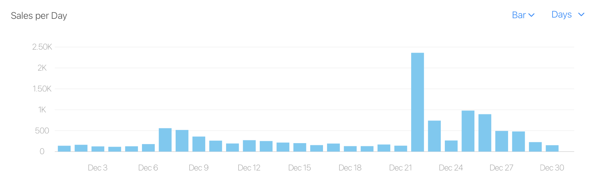
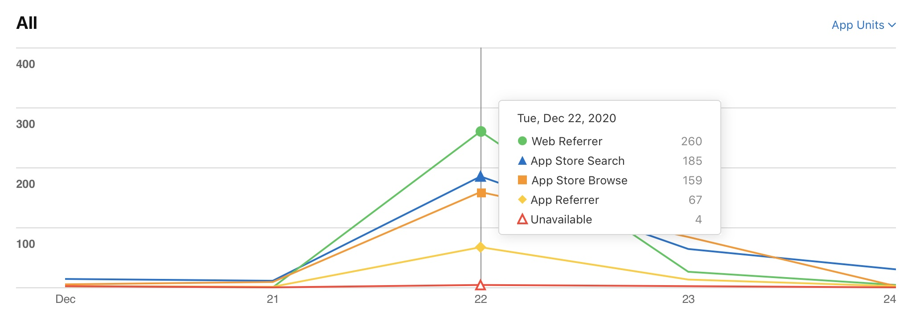
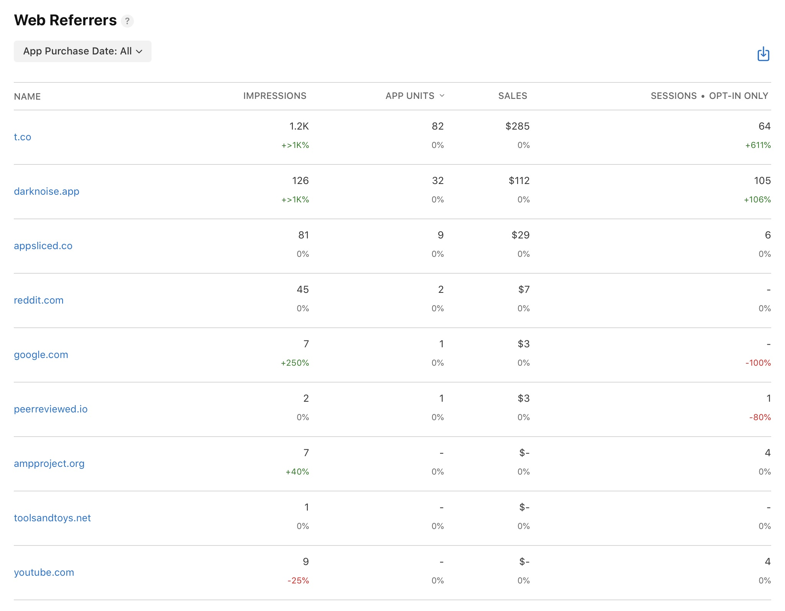
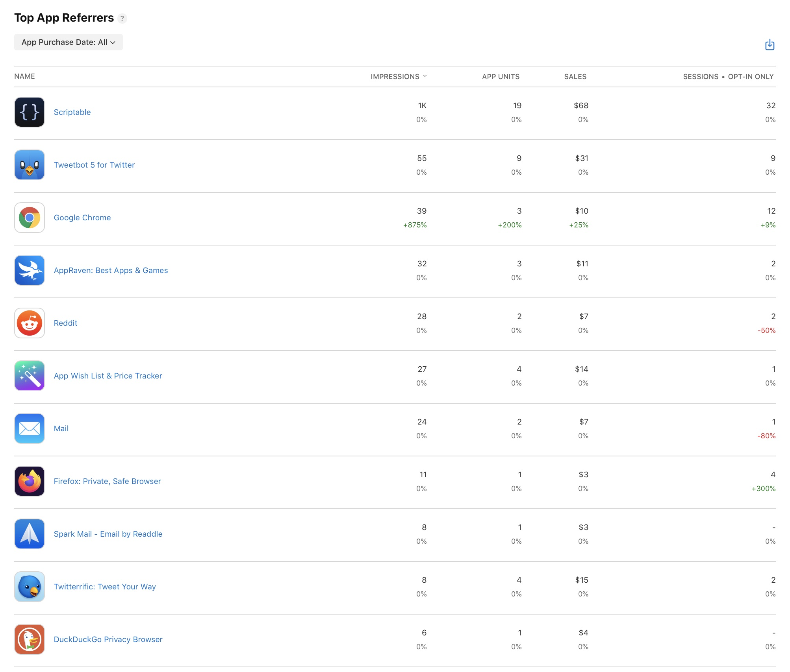

[Dark Noise](https://apps.apple.com/us/app/dark-noise/id1465439395) has been in the App Store for over a year, yet I’ve never actually run a sale before. In fact, the only price change I’ve made at all is increasing the price by a few dollars when I shipped my 2.0 update.

This was due partially to laziness, but also a slight sense of feeling gross about sales for some reason? Truth be told I don’t have a good reason for this, but I had this generic (and quite frankly silly) notion in the back of my mind that it feels slightly desperate and devalues the product somehow.

So when [François](https://twitter.com/frboulais?s=21) reached out about joining his [Indie App Santa](https://twitter.com/indieappsanta) project and putting Dark Noise on sale for 50% for 1 day I was weirdly hesitant. But I figured “what’s the worst that could happen?” and agreed.

Based on literally no data I kinda figured that I’d probably get around double the sales from the Indie App Santa Twitter account promotion and me tweeting about it from my account. At 50% off this would mean I’d pretty much be breaking even on revenue. Since Dark Noise is paid up front with no subscription or in app purchases, this would basically be a wash with a *slight* bump in users.

I was wrong.

Here’s my sales for the month of december. See if you can spot what day the sale took place! 😅

Note: This is sales, not units so the 50% off is already taken into account.

This was a **way** bigger bump than I was expecting, easily making up for the price difference. It’s worth noting it did trail off pretty quickly after the sale ended. It’s a bit hard to tell exactly how quickly because sales bumped again a few days later on Christmas when the app was mentioned in a few “Best apps for your new phone” articles.

One thing I'm curious about is what's driving the sales spike. Indie App Santa has almost 5,000 followers on Twitter who are actively looking for app deals, so I'm curious how much is driven by them and how much is the sale itself.

Lets look at the **Sources** data provided by App Store Connect.

As expected Web Referrers and App Store Search have big spikes, but curiously so is App Store Browse (customers who found the app through general App Store browsing vs direct link or specifically searching my app). Possibly this is because the price is lower so more people who saw the app converted to sales? My conversion rate for the day was up 59.3% (though still very low) but there's so much noise from all the direct sales that this is hard to really tease out what's really going on here.

Let's dig into where the web referrers are coming from.

The actual numbers here are much lower than the numbers on the aggregated "Sources" page in App Store Connect. Not sure what to make of that?

"t.co" is traffic coming from Twitter (I think that's something to do with their url shortener or analytics or something?) so that definitely lines up with what I was expecting. And most other referrers are probably from people doing some research on the app through my website or reviews written about it after they saw the app on sale on Twitter. Somebody also made a [Reddit post](https://www.reddit.com/r/AppHookup/comments/khyrg6/iosdark_noise599_299/) on a subreddit that promotes app sales that drove some sales as well.

App Referrers also has a few interesting tidbits.

Here again actual numbers are lower than the aggregated "Sources" page.

The excellent app [Scriptable](https://apps.apple.com/dk/app/scriptable/id1405459188) at the top is, I believe, a result of their [partnership with Indie App Santa](https://twitter.com/scriptableapp/status/1334849125544841216) where you could make a widget for what app is on sale each day using Scriptable. Tweetbot and Reddit apps make sense for the same reasons as the web traffic (I believe the official Twitter app will always show through Web Referrers because it routes you through Safari when you click links?). 

The interesting bit here is that there appears to be some apps out there still that track apps with price drops that can drive at least a some sales. I'll have to experiment at some point by lowering the price with zero promotion and see how that impacts sales for the day.

Overall I think this experience shows me I should definitely be experimenting with pricing and sales more (duh!). I think I still want to keep them relatively infrequent for now, but in 2021 I think I’ll probably do some more experiments to see what I can do when promoting them on my own.