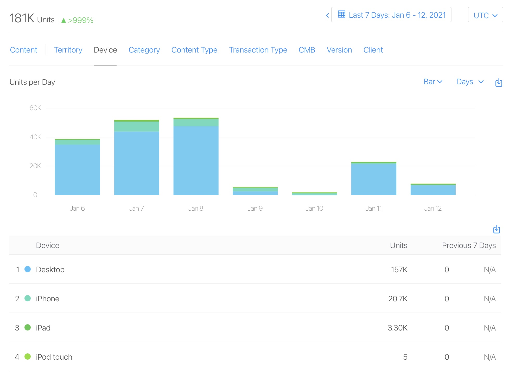
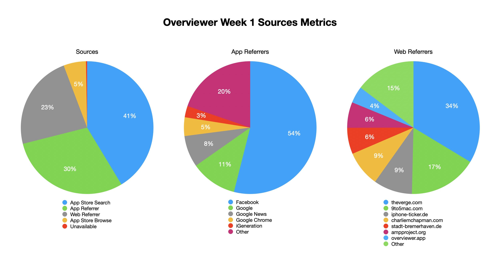

Last week, when I released my new app [Overviewer](https://charliemchapman.com/posts/2021/6/overviewer/), I honestly thought it was a pretty niche product and was just hoping it would find the few other teachers out there who it could help during this wild year of virtual learning. With that in mind, I didn't really do much in the way of marketing like I [did with Dark Noise](https://charliemchapman.com/posts/2019/9/27/marketing-dark-noise/). But it turns out, there's more interest in turning an iPhone into a document camera than I thought! 😅

As is tradition, I'd like to go through some quick metrics for the app launch and see if there's anything. Let's start with the basics:

- 📈 181,000 "App Units Sold" 🤯
- 📍 17,170 Sessions _(opt-in only metrics)_
- ⭐️ 192 ratings avg 4.8 stars
- 📝 57 reviews
- 💥 0 crashes 😁 _(opt-in only metrics)_

Alright, we need to address that ridiculous 181,000 "App Units Sold" number because... that's kind of unbelievable. When something looks unbelievable there's probably a reason. 

The first sign something weird was happening was actually immediately after launch when the app supposedly got [32,000 downloads in the first hour](https://twitter.com/_chuckyc/status/1346899004878106629?s=20). And while "sessions" metrics are only available to users who have opted in to allow developers to see their analytics, 17,170 seems way lower than what you would expect if there were truly 181,000 users.

 It turns out, school districts have access to something called the [Volume Purchasing Program](https://vpp.itunes.apple.com/?l=en) (VPP) that allows them to purchase apps for distribution to all Apple devices in their districts. When an app is free, admins can "purchase" [as many licenses as they want](https://twitter.com/timgostony/status/1347290649049980928?s=20) and [some folks on Twitter](https://twitter.com/sohojoester/status/1347280847959834625?s=20) said they would _"generally buy at least 3x the number of devices I could possible deploy to and then deploy as needed"_.

So most likely these huge numbers of "purchases" are school admins grabbing way more licenses than they'll actually use just to cover their bases. If we break down unit sales by "device" I think we can see this in the data.

Here you can see about 157,000 units were purchased on "Desktop" while about 24,000 were from iOS devices (and 5 on iPod touch 😆). Overviewer isn't available on the Mac, so I think it's safe to say those 157,000 are actually from volume licensing and only a small fraction of those ever end up downloaded to a device. But the 24,000 from iOS devices are probably mostly legitimate downloads.

### Press

These numbers are _way_ higher than I was expecting! So what happened? Unlike with Dark Noise, I didn't try to build up a big TestFlight group or reach out to the press beforehand, but I did make a simple [presskit](https://overviewer.app) and wrote up a [blog post](https://charliemchapman.com/posts/2021/6/overviewer/) with the story behind the app.

Pretty quickly after releasing my blog post, [9to5Mac](https://9to5mac.com/2021/01/06/iphone-document-camera-overviewer-zoom/), [iMore](https://www.imore.com/overviewer-turns-your-iphone-document-camera-zoom-calls), and [Knapsack](https://knapsack.news/overviewer-for-ios-turns-your-phone-into-a-document-camera/) all wrote up articles about the app. This led to a lot of follow-on articles from loads of smaller blogs around the world. Then later in the day, [The Verge](https://www.theverge.com/2021/1/6/22217200/overviewer-app-teachers-overhead-camera-iphone-zoom) wrote about the app! 🤯 I'm going to be honest here, seeing that pop up in my feed almost broke me. I was literally shaking.

I have 2 theories for how I got all this press.

1. I've already built a little reputation with Dark Noise and some relationships that put me on some tech writers' radar right out of the gate.
   
2. I told a compelling, relatable story that fit a broader narrative for the world we all live in right now.

If you don't already have a reputation or relationships with anybody in the press, there's not a lot you can do for the first point. I would say making a decent press kit and cold emailing writers is probably the best you can do here.

Point 2 wasn't exactly something I did on purpose, but it was pretty clear as more articles came in that the story - _"Nerdy Dev Makes App to Help Teacher Wife with Virtual Learning"_ - was the thing a lot of folks were keying in to. It fits neatly into the narrative we're all currently living through, where we're trying to come up with interesting solutions to our pandemic world.

I think telling a compelling, relatable story when announcing your app can go a long way to help you get the word out there.

I also made a [tutorial video](https://www.youtube.com/watch?v=fadOMMpQErg) to try to help explain how the app works, and I think this may have inadvertently added to the personalized story behind the app since I'm the one personally showing the app off on camera.

### Sources

Here are the sources metrics from App Store Connect. As expected The Verge and 9to5 did a lot of the heavy lifting on the Web Referrer side, but the size of Facebook in the App Referrers initially surprised me. I searched around and found that a lot of people (usually teachers) were sharing The Verge article on Facebook. Presumably, since the Facebook app has a built in browser, any links from The Verge to the App Store would actually be counted as coming from the Facebook app.

### Thanks 🙏

I guess I'll wrap up by saying thanks to everyone who shared the app with any teachers or educators they know who might find it useful. Seeing that this little app I made is [being used in the real world](https://twitter.com/_chuckyc/status/1348985834897367040?s=20) and helping teachers and kids learn during this wild year is extraordinarily fulfilling. I've also heard from some people using Overviewer for tabletop gaming with friends over Zoom which is totally awesome and not something I had considered at all.

If you haven't yet can download the app for free on the App Store [here](https://itunes.apple.com/app/id1528900395). And as always, if you have any suggestions for how to improve the app, or if you find another alternate use for it outside of virtual learning, let me know!