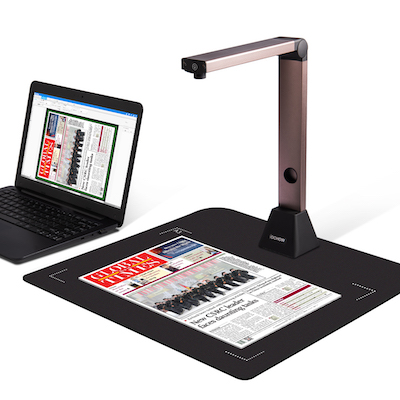

Today I'm releasing [Overviewer](https://itunes.apple.com/app/id1528900395), a totally free new iOS app for teachers that can turn your iPhone into a document camera on Zoom or other video conferencing apps. It's proven difficult to explain what the app is actually for if you don't already know what that is, so let's start with a quick explanation of a document camera (or visualiser for our UK friends).

<a href="https://iochow.com/product/iochow-s1-document-scanner/">iOCHOW S1 Document Scanner</a> - $219

A document scanner is essentially a mounted webcam pointed straight down on a desk that can project or stream a top-down video of anything the presenter wants to physically show on their desk. Many teachers use these now instead of the old overhead projectors for showing worksheets, working through math problems, ect while teaching.

My wife is a Kindergarten teacher and when COVID hit she had to figure out how to teach a bunch of 5 and 6 year olds how to draw letters over Zoom. Initially she made her own document camera using her iPhone and the default camera app. Zoom has a wonderful feature where you can share your iPhone's screen by plugging into your laptop with a lightning cable or even wirelessly over AirPlay but when you open the camera app there are two issues.

1. There's a bunch of buttons and chrome around camera view so it looks clunky
2. The camera app doesn't actually rotate when you turn it sideways (just some of the labels) so you can only share your phone in portrait mode which means huge black bars on each side of the zoom call and a _tiny_ video stream of what you want to share.

So being the dorky husband that I am, I quickly built an app that does nothing other than show what the phone camera sees with zero chrome, and properly rotates the whole app so that you can share it in landscape on zoom. This did the trick and she actually used it! But over time she'd point out little annoyances and I'd add a feature here and there to make it a smoother experience like a button to turn on the flashlight to light the desk, and one for forcing a rotation change. I also went ahead and fully supported streaming it over AirPlay as a sort of learning experience and before I knew it I had an interesting little app on my hands.

I figured this may be useful for other teachers out there so I gave it a fresh coat of paint, a fun icon (with alternates of course 😄) and put it on the store for free. To be honest, I'm not really sure how many people will find this useful. It's pretty tailor made for exactly my wife's use case but I would think that would be a pretty common one for teachers to be in right now in our current virtual teaching world.

So if you've made it this far, here's what I'm asking of you. I know most of you probably wouldn't use this yourselves, but if you know of any teachers or educators in your life that this may help, tell them about the app. It's totally free for a reason! If getting this into the store makes one teacher's life easier this year I'll consider this whole side-project a success 😁.

I also made a little video tutorial to show how it works. This video is specifically for use with Zoom, but the same principle should apply to any video conferencing app that lets you share an iPhone screen.

    <iframe width="100%" height="100%" src="https://www.youtube.com/embed/fadOMMpQErg" frameborder="0" allow="accelerometer; autoplay; encrypted-media; gyroscope;  picture-in-picture" allowfullscreen></iframe>

There's also a link to this video inside of the app as well.

You can download the app on the App Store [here](https://itunes.apple.com/app/id1528900395). If you have any suggestions for how to improve the app, or if you find an alternate use for it outside of virtual learning, let me know!