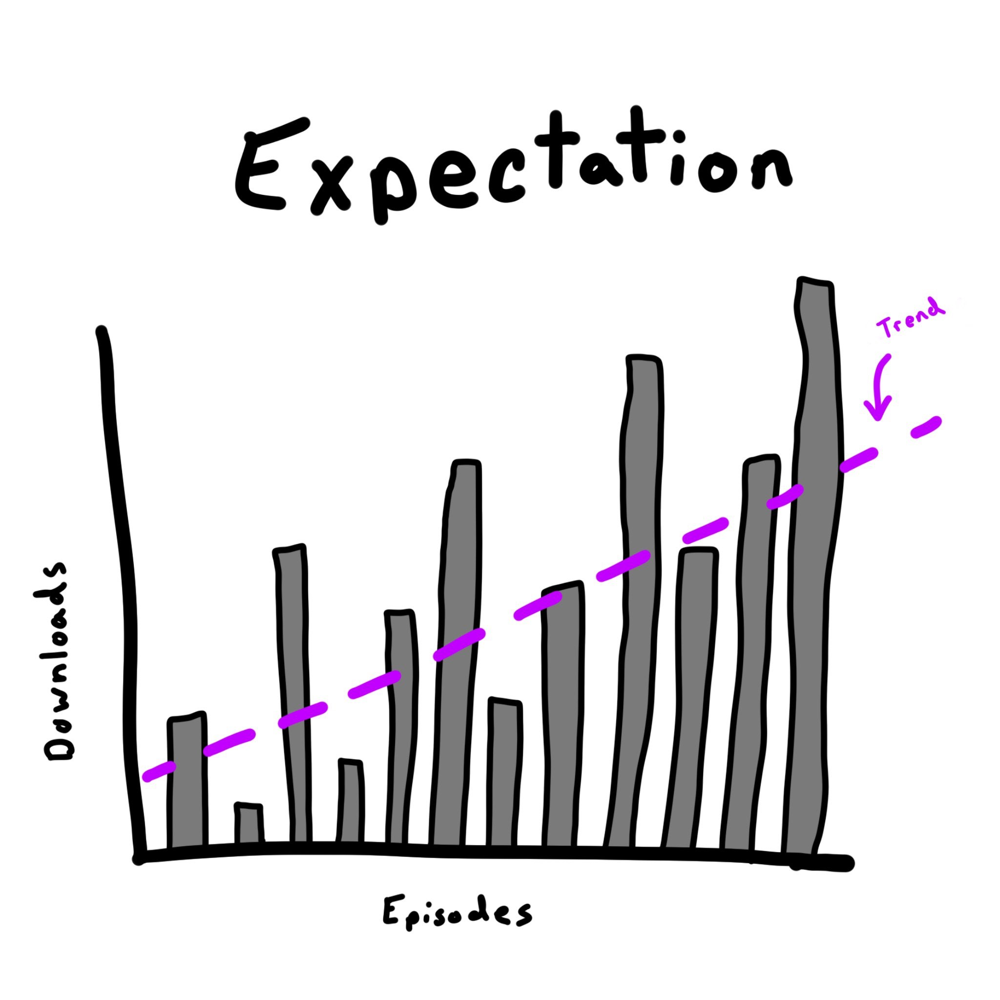
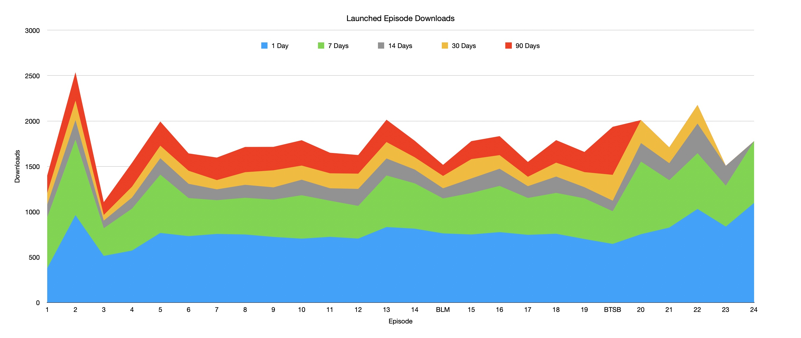
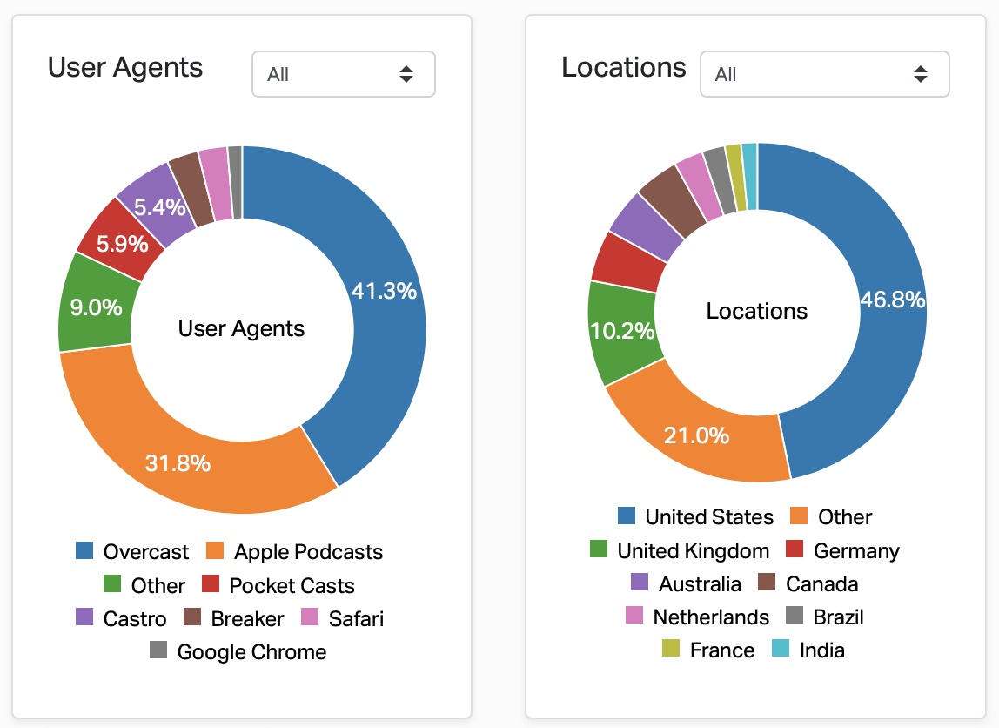

One year ago today I released my first episode of [Launched](https://charliemchapman.com/posts/2020/1/13/introducing-launched/). While January 2020 feels like a different world than January 2021, I still think 1 year in is a good time to assess how the project is going compared to my initial goals. And just as I did after [week 1](https://charliemchapman.com/posts/2020/1/21/launching-launched/), I'd like to run through the metrics and see if there are any interesting findings.

But first, some quick vanity metrics!

1. ⬇️ 53,666 Total Downloads
2. ⏱ 27 hours 33 minutes of total content
3. 🐦 1,067 [Twitter](https://twitter.com/launchedfm) Followers
4. ⭐️ 5.0 Rating on Apple Podcasts[^1]

### Great Expectations

Let's start with expectations. In my [Launching Launched](https://charliemchapman.com/posts/2020/1/27/launching-launched/) post I explained the 3 main reasons why I started the show.

> Any project that's going to require a significant investment of your time deserves to have this question answered: Why? For me, there is one "altruistic" answer and two selfish ones.
>
> 1. I want this to exist and genuinely think other devs and creators would find it beneficial.
>
> 2. I think it could help me raise my profile in the community which would help with future app launches and all the nice benefits of having a strong network.
> 
> 3. I'd get to meet and talk to a bunch of interesting people whose work I really respect.
>
> My understanding is that the vast majority of podcasts fail to reach a substantial audience, so 1 and 2 may never happen. But 3 is a benefit I get either way, so in the end, I felt it was worth giving it a shot.

I'm counting #3 as an unambiguous success ✅. Just look at [this guest list](https://launchedfm.com)! I still can't believe I got to talk to all of these people. Not only with huge inspirations for me in the iOS developer community but also internet creator heroes I've been looking up to for years and years like [Seth Worley](https://launchedfm.com/episodes/12-SethWorley/) and [Myke Hurley](https://launchedfm.com/episodes/5-MykeHurley/).

For #1, I'm giving myself a pass as well. The show exists ✅ and I've heard from more than one listener that they find it beneficial ✅.

\#2 is a bit trickier to measure. Based only on listener metrics I'm not sure how much the show has "raised my profile" as we'll see in the next section, but I think there's no doubt it's helped benefit my network within the iOS community. In a year devoid of networking events, I've been able to have regular long conversations with developers I admire every other week.

### Metrics

Because Launched is an interview show my expectation for downloads was a lot of variation in each episode (since each guest brings different sized audiences along) but hopefully slow growth over time since each guest's audience would hopefully bring a few new subscribers. 

Something like this:

Instead, here are the downloads for every episode in year 1. It's separated by day 1 of release to day 90 of release since the most recent episodes haven't been out as long and it wouldn't be accurate to compare total downloads. So you can compare all of the "7 Days" download numbers (green) for each episode for example.

This wasn't at all what I was expecting 😅. After the spikyness of the first 5 episodes (which was unique in that I released an episode every day), it pretty much completely leveled off into a nearly flat line. Very few spikes and almost no valleys.

I have to admit that, despite all my lip service about my goals not being about audience size, this was a little disappointing. Admittedly I didn't do much in the way of marketing after the initial launch, nor do I really know what options I even have (feel free to reach out if you have any ideas 😁). I think I just incorrectly internalized that if I could bring on interesting guests and keep at it regularly that I would probably grow, despite intellectually knowing that the vast majority of podcasts don't reach that big of an audience.

There is some hope, however! Episode 20 with [Brian Mueller](https://launchedfm.com/episodes/20-CARROTWeather-BrianMueller/) was the first episode after an extended "Back to School Break" and it saw a pretty big bump in downloads (I don't have 90 day numbers for it yet though). And it looks like each episode after has sustained a larger average than before the break.

Time will tell if this is a trend or a fluke, but it does feel nice to see a little boost in the audience size.

And here's the user agent and location metrics:

I don't have much commentary to add here other than pointing out that Overcast having a bigger percentage than Apple Podcasts is, I think, evidence of the nerdy, iOS centric profile of my listenership 😅. 

Also, as someone who lives in a small midwestern American city, it's very cool to see how many countries people are listening from!

### Diversity

One of the areas where I've failed my original ambitions is ensuring a diverse list of guests. Of the first 24 episodes, 14 are white men, and only 3 episodes have women guests.

I think my failure here comes _before_ scheduling and booking. My problem is I don't know or follow enough diverse indie developers. 

Everybody I bring on the show is someone whose work I genuinely admire and look up to. And I really don't think the right thing to do is to bring on token diverse people, so I need to expand my network to find the folks doing interesting work who come from different backgrounds than me. I don't know what the best method for addressing this is though, so if you've read this far and you have any ideas _please_ let me know!

### Wrap Up

Overall I'm really proud of Launched. I think I've produced a high-quality show featuring interesting guests filled with fun and educational conversations. It's honestly a lot of work, but for now, it's worth all of the effort.

2020 threw a curveball at everybody's life and for me Launched helped get through it. It provided the excuse to connect with a lot of developers I was really hoping to get to meet at conferences and meetups that no longer happened this year.

To all of you who listen, I can't thank you enough. 

[^1]: In the US. I don't know how to aggregate international Apple Podcast reviews